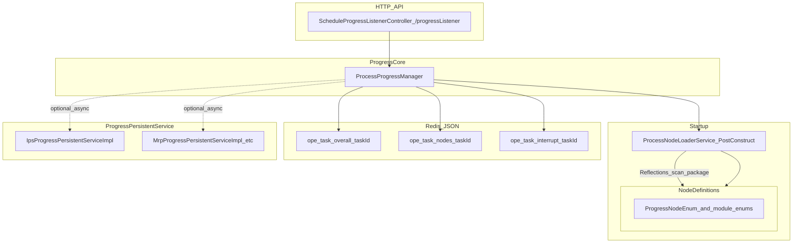
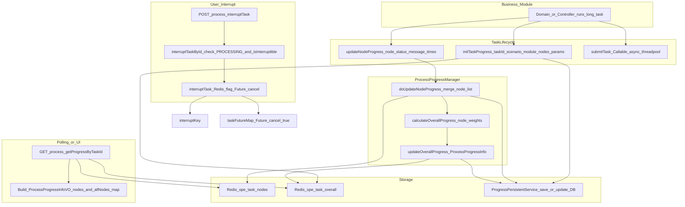

# IPS 运行监控中心 — 开发培训

本文档面向开发与实施同事，说明**运行监控中心**的业务价值、界面与操作闭环，以及业务功能接入时需交付的信息约定。可与 **[节点拆分SKILL.md](../节点拆分SKILL.md)** 配合使用（用 AI 辅助拆节点时加载该文件即可，本文不展开 SKILL 正文）。

**说明**：当前阶段允许进度与部分结果为**模拟或联调中数据**；与正式后端 API 的对接按项目迭代节奏落地。界面交互可参考产品侧提供的**运行监控中心原型**（本地静态工程或设计稿）。

---

## 第一部分：运行监控功能介绍（业务视角）

### 1. 功能作用：解决什么问题、谁在用

SCP 各业务模块里存在大量**一次运行的长时任务**（如历史需求清洗、供需匹配、排程、报告生成、安全库存、接口同步等），往往需要数分钟甚至更久。过去这类任务的**入口分散**、**进度与结果说法不统一**，运维和业务巡检时要跨多个菜单才能回答「今天跑了什么、哪些还在跑、失败在哪」。

**运行监控中心**把各模块的长时任务收敛到**同一套交互与视觉规范**下：用「选功能 → 发起运行 → 看进度或排队 → 必要时终止 → 在历史里查结果、下文件、看节点」一条路径完成日常巡检与排错。主要使用者包括**运维、业务配置、实施与支持**。

### 2. 页面布局：用户看到什么

整体形态是**一个主页面（功能详情页）+ 若干弹窗**。

**主页面（功能详情页）**

- **顶部**：运行监控中心标题；**功能切换下拉框**（切换不同业务功能，各自对应一套执行历史）；**运行按钮**（文案按功能配置，如「执行清洗」「计算安全库存」）。
- **筛选区**：任务 ID、操作人关键字、开始日期范围、任务状态（全部 / 成功 / 失败 / 运行中 / 已终止 / 排队中）、查询、重置。
- **执行历史列表**：每行展示任务 ID、开始时间、时长、操作人、计划版本（若该模块有版本概念）、进度（步骤分数如「2/4」或排队位置如「第 3 位」）、状态；左侧状态条与图标，右侧按状态提供操作（如成功可下「算法文件」、失败可下「报错日志」、运行中可「查看详情」、各类均可看「节点」等；**已终止**任务不提供算法文件与报错日志下载，操作区占位仍与成功/失败行对齐，避免布局错位）。
- **行展开**：可查看本次运行的输入信息快照、运行日志、计算结果、摘要等（具体字段随功能定义）。
- **底部分页**：每页条数可选、页码与总条数提示。

**弹窗**

- **运行配置弹窗**：收集通用配置（若该功能需要：运行模式、策略模式、策略名称）与**功能差异化参数**；必填未填不可提交。
- **运行进度弹窗**：标题区分「正在执行」与「查看运行进度」；中部为整体进度（当前步骤 / 总步骤）与**步骤时间线**；查看运行中任务时，右上角提供**性能详情入口**与**终止**（终止需二次确认）。
- **性能详情弹窗**：展示本任务在各节点上的执行情况、业务指标等（具体指标由各功能定义），用于缓解「是否卡死」的焦虑。
- **执行节点详情弹窗**：按步骤列出每步状态（未执行 / 执行中 / 已完成 / 失败 / 已终止）及说明，失败或终止时高亮对应步骤。

列表与进度弹窗在运行中会**定时刷新**（频率需平衡实时性与性能）；刷新不应打断用户正在做的筛选、分页或查看详情等操作。

### 3. 用户可操作流程（端到端）

1. 用户进入**运行监控中心**，默认进入**功能详情页**（当前功能的执行历史）。
2. 通过顶部**功能切换下拉框**切换功能，列表切换为**该功能**的历史记录。
3. 点击**运行按钮** → 打开**运行配置弹窗** → 填参后点「确认并开始」：
   - 若功能为**可并行**：直接创建任务并进入运行中，关闭配置弹窗并打开**运行进度弹窗**。
   - 若功能为**不可并行**且已有任务在跑：提示「上一次运行正在进行中，请稍后再试」，不创建新任务。
   - 若功能为**可排队**：创建**排队中**任务，提示排队位置，关闭配置弹窗；列表中该任务显示排队位置，轮到后自动变为运行中。
   - 若功能为**限制并发数**且已达上限：提示当前运行数已满，稍后再试。
4. **运行进度弹窗**展示整体进度与步骤时间线；用户可看**性能详情**；可在允许时**终止**。若当前落在**不可终止**节点（如关键写库、事务提交），应提示用户等待该节点完成后再终止，或在前端禁用终止，避免破坏数据一致性。用户可**关闭进度弹窗**，任务在后台继续直至结束。
5. 历史列表随状态变化更新：**运行中**可看「查看详情」与进度；**成功**可下载算法文件、展开看结果与日志；**失败**可下载报错日志、展开排查；**已终止**仅标识与节点等约定操作，不提供算法文件与报错日志下载；**排队中**展示排队位置。
6. 任意任务可点**「节点」**打开**执行节点详情**，按步骤看状态与说明。
7. 用户可用**筛选 + 分页**在历史中检索；默认按开始时间倒序。

**任务状态与列表侧要点**

| 状态   | 用户感知要点 |
|--------|----------------|
| 排队中 | 等待执行，进度列显示排队位次。 |
| 运行中 | 步骤进度可更新；可进进度弹窗看详情/性能/尝试终止。 |
| 成功   | 可下载算法文件；展开看输入、日志、结果、摘要。 |
| 失败   | 可下载报错日志；展开辅助排查。 |
| 已终止 | 用户主动终止；不提供算法文件与报错日志下载；可看节点等。 |

**状态迁移（实现需一致）**

- 提交时：按并发策略进入**运行中**或**排队中**。
- 排队轮到：排队中 → 运行中。
- 正常结束：运行中 → 成功（记录结束时间、耗时、摘要等）。
- 执行异常：运行中 → 失败（保留当前步骤与日志）。
- 用户确认终止：运行中 → 已终止；关闭进度弹窗并刷新列表。

**并发模式（四选一）**

- **可并行**：同一功能可同时跑多个。
- **不可并行**：同一功能只能跑一个，再来会提示稍后再试。
- **可排队**：同时只跑一个，多出来的排队并显示位置。
- **限制并发数**：同时最多 N 个（N 需配置），超出则提示稍后再试。

---

## 第二部分：业务功能如何接入运行监控

以下为平台侧对「接入一个可监控功能」的**信息清单与行为约定**，不绑定具体配置表、注册中心或接口形态。

### 1. 接入前提（归属与展示）

- 明确功能所属**业务模块**；若模块尚未登记到运行监控中心，需先完成模块级接入。
- 提供在中心内展示的：**功能名称**、**简要描述**、**运行按钮文案**（如「执行 XX」「计算 XX」）。

### 2. 运行前参数

- 列出发起运行前需用户填写或选择的**业务参数**（数据源、日期范围、计划版本、规则、对象范围等），并标明**必填项**；中心以统一弹窗收集，并在运行记录中保留**输入快照**。
- 若该功能需要**通用配置**（运行模式、策略模式、策略名称），须声明并在配置弹窗展示；否则仅展示本功能专属参数。

### 3. 并发控制模式（必选其一）

为每个功能声明一种模式，供中心统一管控：

- **可并行** / **不可并行** / **可排队** / **限制并发数**（后者需给出最大并发数 N）。

### 4. 运行节点（接入核心）

- **为什么必须定义节点**：仅有任务级「成功/失败/运行中」无法回答「卡在哪一步、哪一步有告警、各步产出多少」；节点是监控中**最重要的信息载体**。
- **拆分原则**：
  - 按**业务可理解的逻辑步骤**划分，不按函数或线程粒度。
  - 节点间有**清晰顺序或可归并的依赖**；若存在**并行分支**，须约定在展示层如何**归并为一条主时间线**，以便与「当前步骤 / 总步骤」一致。
  - **顶层节点**建议 **5～15 个**；过粗不利于定位，过细信息噪音大；复杂步骤可用**父子节点**，层级建议不超过 2～3 层。
- **每个节点应能上报**：
  - **执行耗时**；
  - **成功类信息**（处理条数、生成数量、通过率等业务指标，命名用业务语言）；
  - **报错信息**（失败、异常码、失败条数等）与**警告信息**（完成但存在风险时的统计与说明）。

### 5. 平台统一管控的两类节点参数

接入时除节点名称与顺序外，还需为每个节点配置（实现上可为通用参数，由运行监控中心统一执行策略）：

**（1）节点可终止性**

- **目的**：避免用户在关键写库或提交阶段误终止导致数据不一致。
- **可终止**：如数据加载、校验、计算等可中断且不易破坏一致性的步骤；用户终止后任务变为**已终止**。
- **不可终止**：如结果持久化、事务提交、写回、分配关系重建等；此期间应拒绝立即终止或提示等待该节点结束后再终止。

**（2）节点异常处理策略**

- **异常可跳过**：该节点失败时记录异常并展示，但**不**将整个任务判失败，继续后续节点；适用于辅助校验、可选数据补充等。
- **异常必须终止**：该节点失败时**立即**将任务置为失败并停止后续节点；适用于关键数据加载、核心计算、持久化等。

各功能按自身业务判断；典型参考：**BOM 死循环**等往往须**终止整任务**；**单物料无供应**等可设计为**警告并继续**（以实现与业务规则为准）。

### 6. 任务标识与状态

- 每次运行需有**全局唯一任务 ID**（格式由实现与后端约定，宜能从 ID 识别模块/功能）。
- 任务状态需随执行过程更新，并与列表、进度条、步骤时间线一致；中心依赖这些状态驱动界面。

### 7. 与 AI 协作拆分节点（推荐流程）

1. 用业务语言写清：功能目标、运行入口、关键参数、大致步骤（可先按「数据输入 → 处理 → 数据输出」列大步骤）。
2. 准备好**相关代码位置**（接口路径、Controller/Service、前端页面或 API 封装路径等），便于对照真实逻辑。
3. 加载 **[节点拆分SKILL.md](../节点拆分SKILL.md)**，与 AI 生成节点表及并发、性能、可终止性、异常策略等建议。
4. **人工对照代码**校准节点名称、顺序及成功/报错示例是否与实现一致。

### 8. 示例对照（业务侧样板）

**物料需求计算（MRP 运行 / 供需匹配）**可作为样板：从「数据输入 → 处理 → 数据输出」拆出约 8 个业务节点（低阶码与环境、策略与周期、数据准备、层级排序、净需求计算、计划供应与下层推导、结果持久化、分配关系与工单同步等），并为每步约定成功信息与报错/警告示例。其他功能接入时对齐同一思路即可。

### 9. 权限与数据量（后端落地时）

运行、终止、下载算法文件、下载报错日志等需按权限控制；报错导出需考虑脱敏与安全规范。执行历史须**分页**与筛选查询；超大数据量时后端需支持稳定排序与分页（必要时游标等），避免一次拉全表。

---

## 附录：`scp-foundation` 运行进度框架（基于release17，2026-04-21）

以下基于仓库 **`scp-foundation`** 中 **`scp-common`** 模块的进度能力梳理，供后端与前端联调时对照。各业务模块在运行链路中调用 `ProcessProgressManager`，并通过各模块实现的 **`ProgressPersistentService`** 将进度落到 IPS 等持久化服务（如 `IpsProgressPersistentServiceImpl` → `OpeTaskPersistenceService`）。

**主要包路径**：`scp-foundation/scp-common/src/main/java/com/yhl/scp/common/progress/`

| 职责 | 典型类型 |
|------|----------|
| 节点定义 | 各模块或 common 下实现 `ProgressNodeEnum` 的**枚举**（含 `processType`、`nodeCode`、顺序、进度权重、是否可中断等） |
| 启动时加载节点 | `ProcessNodeLoaderService` 扫描 `com.yhl.scp.common.progress.entity.nodes` 下枚举并缓存 |
| 进度核心 | `ProcessProgressManager`：初始化任务、更新节点、计算整体进度、中断、异步提交任务等 |
| 对外查询与中断 | `ScheduleProgressListenerController`，映射前缀 `/progressListener` |
| 持久化扩展点 | `ProgressPersistentService`（如 `scp-ips-sdk` 中 `IpsProgressPersistentServiceImpl`） |

**Redis 键前缀（节选）**：整体进度 `ope:task:overall:{taskId}`，节点列表 `ope:task:nodes:{taskId}`，中断标记 `ope:task:interrupt:{taskId}`。节点与整体信息以 JSON 形式缓存；是否写库由节点枚举的持久化策略及 `ProgressPersistentService` 决定。

### 框架逻辑结构（Mermaid）

### 任务进度更新与查询（Mermaid）

**联调提示**

- `getProgressByTaskId` 从 Redis 读取整体进度，并合并**枚举定义的全节点顺序**与**当前任务已上报的节点列表**，供前端画时间线与百分比。
- `interruptTask` 注释标明宜在**发起任务的同一服务进程**内调用（依赖 `Future` 与线程映射，**不可跨服务**直接依赖当前实现完成硬中断）。
- 业务代码在关键步骤调用 `updateNodeProgress`（及失败时的 `recordTaskError` 等），与界面节点状态保持一致。

---

*文档用途：开发人员培训与接入对齐；节点拆分协作见同目录 `节点拆分SKILL.md`。*
