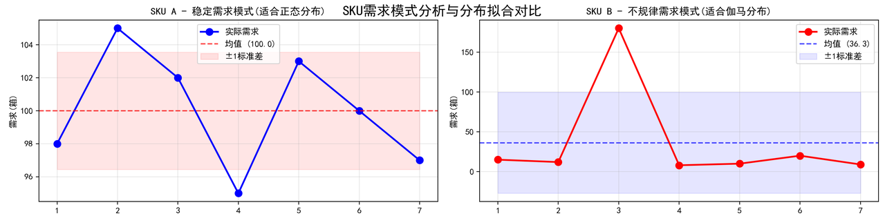
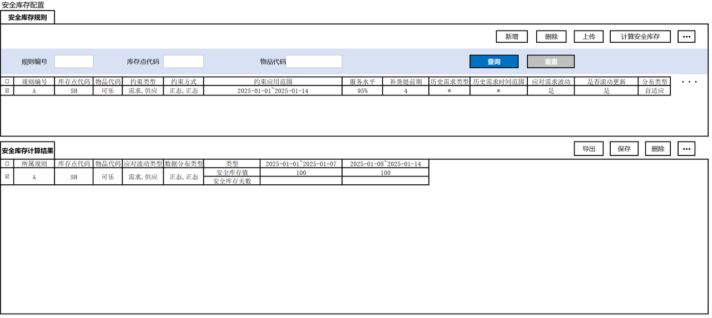
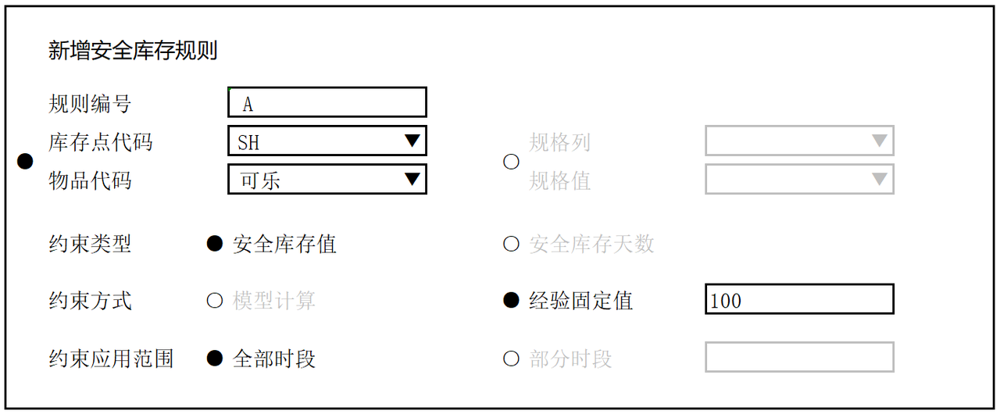
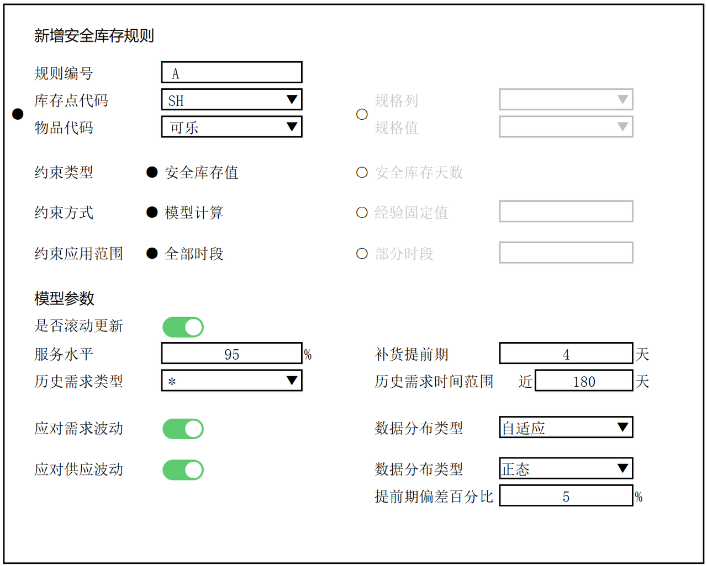
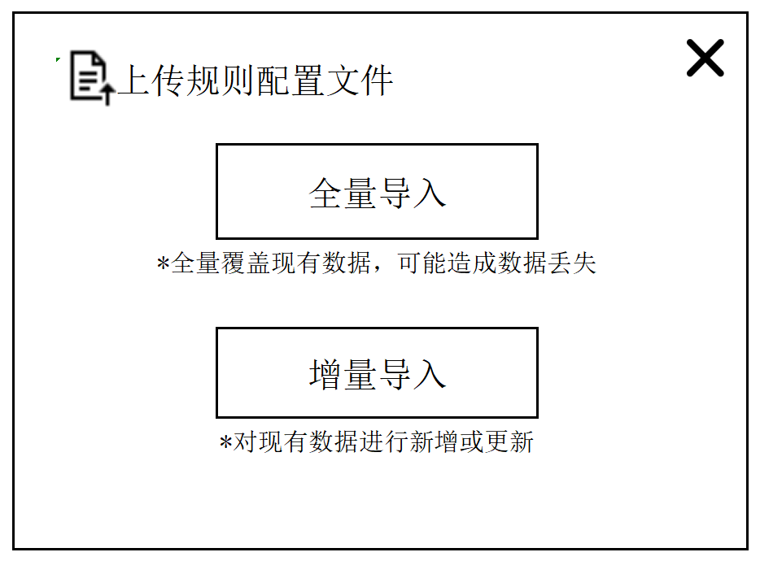

| **日期**     | **修订人** | **描述**               |
| ---------- | ------- | -------------------- |
| 2025年8月12日 | 区卓挥     | 0.1-初始版              |
| 2025年8月27日 | 区卓挥     | 1.0-完整版初稿            |
| 2025年8月29日 | 区卓挥     | 2.0-修改版              |
| 2025年9月1日  | 区卓挥     | 3.0-基于2.0的UI改善版      |
| 2025年9月29日 | 区卓挥     | 4.0-基于3.0的功能增补和UI重做版 |

# 1. **流程概览**

## 1.1 **安全库存模块主体流程**

安全库存一般用于应对需求波动或供应波动，是企业用于应对供应风险的重要手段之一。
在计划系统中，安全库存模块的主体流程包括：计划员根据实际业务情况配置各物品的安全库存规则（手动输入的经验值、基于历史需求计算的静态安全库存、动态安全库存）、系统根据安全库存规则为各物品计算未来计划期内各时段的安全库存、计划生成后呈现各计划时段安全库存的满足情况。

1. 用户配置安全库存规则

2. 系统根据规则计算安全库存

3. 用户手工调整计算结果


# 2. 详细方案

## 2.1 **安全库存的配置与计算**

### 2.1.1 需求描述

用户可在安全库存页面中为各库存点物品配置安全库存规则，并填写各规则的各项参数。同时，安全库存模块不仅要根据安全库存规则计算安全库存结果，还要支持用户进行手工调整。

### 2.1.2 KPI

无

### 2.1.3 输入数据

#### 2.1.3.1 历史需求

#### 2.1.3.2 安全库存规则

##### 2.1.3.2.1 规则参数表

##### 2.1.3.2.2 模型参数表


**<span style="color: rgb(216,57,49); background-color: inherit">*</span>**&#x7528;户可以填写导入模板，直接导入规则。导入时**用户要注意、系统也应校验**：

* 库存点代码+物品代码，规格列+规格值，必须二选一，不可都填

* 同一库存点物品（包括通过规格列+规格值筛选出来的库存点物品），在同一时段上只能有一种规则

* 如果 约束方式 = 模型计算，则2.1.3.2.2模型参数表中，是否必填 = Y的字段均要填，N不填，非Y非N的看情况。


**<span style="color: rgb(216,57,49); background-color: inherit">*</span>**&#x5BFC;入后将新增规则，或更新规则。如果是更新规则：

* 更新依据：规则编号

* 更新字段：除规则编号外的所有字段

* **更新时要同步删除该规则下的安全库存计算结果**


### 2.1.4 输出数据

#### 2.1.4.1 安全库存计算结果


### 2.1.5 业务流程

#### 2.1.5.1 历史需求

用户可在历史需求页面中导入各库存点物品的历史数据，用于模型计算需求标准差。

#### 2.1.5.2 安全库存规则

##### 2.1.5.2.1 查询已有安全库存规则

用户可在查询条件框中填写信息，然后点击“查询”按钮筛选出对应的安全库存规则。可以点击“重置”清除所有查询条件框中的信息，并重新显示所有数据。

##### 2.1.5.2.2 新建安全库存规则

提供两种新建方式：

* 可以在安全库存页面中点击“新建规则”按钮，为各库存点物品新建安全库存规则。也可以用“规格列+规格值”批量为多个库存点物品新建相同的安全库存规则。

* 可以点击“上传规则”按钮，弹出对话框，点击“全量导入”或“增量导入”，直接导入文件（excel导入模板）

##### 2.1.5.2.3 填写规则参数

用户新建安全库存规则时，需填写对应的规则参数，即约束类型、约束方式、约束应用范围。

约束方式和约束类型会有4种组合，含义如下：

| 约束方式\约束类型 | 安全库存值       | 安全库存天数      |
| --------- | ----------- | ----------- |
| 经验固定值     | 用户输入的安全库存数值 | 用户输入的安全库存天数 |
| 模型计算      | 后端计算的安全库存数值 | 后端计算的安全库存天数 |

约束应用范围，即约束应用时间范围，指安全库存值或安全库存天数应用在哪些时段上。默认\*，即应用在计划期全部时段上。

##### 2.1.5.2.4 填写模型参数

如果 约束方式 = 模型计算，则需要填写模型参数。

| 参数             | 含义                                       |   |
| -------------- | ---------------------------------------- | - |
| 是否滚动更新         | 是否根据历史需求滚动更新。若为是，当该物品的历史需求数据更新变动时，要触发重算。 |   |
| 应对需求波动\_数据分布类型 | 可以指定数据的分布类型（正态or伽马），也可以让模型自己判断（自适应）      |   |
| 提前期偏差百分比       | 经验值，实际补货提前期与期望的平均偏差多少                    |   |
| 应对需求波动\_数据分布类型 | 目前只支持正态分布                                |   |

##### 2.1.5.2.5 修改安全库存规则

提供两种修改方式：

* 可以点击“上传规则配置文件”按钮，选择“全量导入”覆盖或“增量导入”更新

* 可以在前端UI**双击**规则表中的数据格进入编辑模式，填写完后点击“保存”按钮保存

**<span style="color: rgb(216,57,49); background-color: inherit">*</span>**&#x901A;过前端UI修改时，除了规则编号、库存点代码、物品代码，其它字段的单元格均可以进入编辑模式。**保存时后端要校验数据是否合规。**

##### 2.1.5.2.6 删除安全库存规则

用户可勾选需要删除的规则，点击“删除”按钮进行删除。

删除规则时，系统要**同步删除规则产生的计算结果**，通过计算结果的“所属规则”关联。

##### 2.1.5.2.7 计算

用户勾选需要计算的规则，或者不勾选（全局），点击“计算安全库存”按钮进行计算。

#### 2.1.5.3 安全库存计算结果

在运行算法前，用户可在安全库存计算结果页面查看各库存点物品在各时段的安全库存计算结果，即安全库存约束，还可以直接修改、删除安全库存计算结果行。

##### 2.1.5.3.1 查询已有安全库存计算结果

用户可在查询条件框中填写信息，然后点击“查询”按钮筛选出对应的安全库存规则。

可以点击“重置”清除所有查询条件框中的信息，方便重新填写。

##### 2.1.5.3.2 修改安全库存计算结果

用户可在前端UI**双击**数据表中的数据格进入编辑模式，填写完后点击“保存”按钮保存

**<span style="color: rgb(216,57,49); background-color: inherit">*</span>**&#x901A;过前端UI修改时，除了所属规则、库存点代码、物品代码、应对波动类型、数据分布类型、类型，其它字段的单元格均可以进入编辑模式。

##### 2.1.5.3.3 删除安全库存计算结果

用户可勾选需要删除的结果，或者不勾选（全局），点击“删除”按钮进行删除。

##### 2.1.5.3.4 导出安全库存计算结果

用户可点击“导出”按钮导出全部结果数据。


### 2.1.6 业务规则和知识

#### 2.1.6.1 规则填写规范

* 库存点代码+物品代码，规格列+规格值，只能二选一

* 多个规格值要按顺序对应多个规格列，用英文逗号隔开

* 约束应用范围，开始日期\~结束日期，格式为YYYY-MM-DD\~YYYY-MM-DD。开始日期要在时段开始时间中找得到；结束日期要在时段结束时间中找得到。

* 同一库存点物品在同一时段上只能有一种规则，即同一库存点物品如果存在多条规则，这些规则的约束应用范围不能重合。规格列+规格值的规则也需转换为具体的库存点物品进行检查。

假设系统2025年时段如下

| 时段ID | 开始时间  | 结束时间  | 天数 |
| ---- | ----- | ----- | -- |
| 1    | 1月1日  | 1月7日  | 7  |
| 2    | 1月8日  | 1月14日 | 7  |
| 3    | 1月15日 | 1月21日 | 7  |
| 4    | 1月22日 | 1月28日 | 7  |
| 5    | 1月29日 | 1月31日 | 3  |

则

| 约束应用范围                                                                                       | 是否合规 | 不合规原因              |
| -------------------------------------------------------------------------------------------- | ---- | ------------------ |
| 2025-01-01\~2025-01-21                                                                       | YES  |                    |
| 2025-01-01\~<span style="color: rgb(216,57,49); background-color: inherit">2025-01-15</span> | NO   | 2025-01-15不是时段结束时间 |

* 多个历史需求时间范围要按顺序对应多个历史需求类型，用英文逗号隔开

* 如果 约束方式 = 经验固定值，还要填具体的约束值&#x20;

* 约束值≥0

* 服务水平只能填\[5%, 99%]

* 补货提前期>0

* 历史需求时间范围如果不填\*，要填>0

* 如果 应对需求波动\_是否启用 = Y，应对需求波动\_数据分布类型要填

* 如果 应对供应波动\_是否启用 = Y，应对供应波动\_数据分布类型、提前期偏差百分比要填

* 提前期偏差百分比>0

#### 2.1.6.2 正态分布&伽马分布

标准产品引入两种分布类型，正态分布和伽马分布，用于描述物品的**需求波动**情况。**供应波动直接假设为正态分布**。

| 分布类型 | 特点          | 适用场景               |
| ---- | ----------- | ------------------ |
| 正态分布 | 分布对称、波动稳定   | 销量稳定的SKU           |
| 伽马分布 | 分布不对称、波动不稳定 | 销量**偶尔**出现爆炸增长的SKU |



#### 2.1.6.3 计算的前置准备工作

无论是成品、半成品还是原材料，它们的未来需求是不确定的，有波动性，未来供应时间可能也是不确定的，因此需要备额外的安全库存去应对。如果用户已进行过统计，可直接输入安全库存值或天数；如果用户没有统计经验，可选择模型计算，让系统根据历史数据算出安全库存值或安全库存天数。

##### 2.1.6.3.1 取出参与计算的历史需求数据

示例场景：

| 历史需求类型  | 历史需求时间范围 |
| ------- | -------- |
| 外部需求,\* | \*,30    |

第一组表示取外部需求的所有数据，第二组表示取近30天的所有数据。（两者可能有交集，需要去重）

| 历史需求类型    | 历史需求时间范围 |
| --------- | -------- |
| 外部需求,内部需求 | \*,30    |

第一组表示取外部需求的所有数据，第二组表示取近30天内部需求的所有数据。（两者无交集）

| 历史需求类型  | 历史需求时间范围 |
| ------- | -------- |
| 外部需求,\* | 30,\*    |

第一组表示取近30天的外部需求的数据，第二组表示取所有数据。（其实第一组是无意义的，因为它是第二组的子集）

##### 2.1.6.3.2 判断物品的需求波动服从哪种分布

如果用户在模型计算的 应对需求波动\_数据分布类型 = 自适应，系统要用卡方检验判断需求波动具体属于哪种分布。

下面是卡方检验步骤示例：

1. 按假设分布类型了解要计算的参数

<table>
<thead>
<tr>
<th>分布类型</th>
<th>参数</th>
</tr>
</thead>
<tbody>
<tr>
<td>正态分布</td>
<td>均值\mu、标准差\sigma</td>
</tr>
<tr>
<td>伽马分布</td>
<td>形状参数\alpha、尺度参数\beta</td>
</tr>
</tbody>
</table>

伽马分布的$$\alpha$$和$$\beta$$可以转换成

$$\begin{align}
\alpha = \frac{\mu^2}{\sigma^2}
\end{align}$$

$$\begin{align}
\beta = \frac{\sigma^2}{\mu}
\end{align}$$

* 参数计算公式

假设

| 时段（周） | W1 | W2 | W3 | W4 | W5 | W6 | W7 |
| ----- | -- | -- | -- | -- | -- | -- | -- |
| 销量（件） | 1  | 2  | 3  | 4  | 5  | 6  | 7  |

根据公式

$$\begin{align}
\mu &= \frac{1}{N} \sum_{i=1}^{N} D_i
\end{align}$$

$$\begin{align}
\sigma &= \sqrt{\frac{1}{N} \sum_{i=1}^{N} (D_i - \mu)^2}
\end{align}$$

可得

$$\begin{align}
\mu &= 4,\sigma= 2
\end{align}$$

* 数据分组

正态分布和伽马分布的数据分组计算方式相同。

根据组数公式有：

$$\begin{equation}
\text{组数} = 1 + \frac{\log_{10}(N)}{\log_{10}(2)} = 1 + \frac{\log_{10}(7)}{\log_{10}(2)} ≈ 4
\end{equation}$$

根据组距公式有：

$$\begin{equation}
\text{组距} = \operatorname{roundup}\left( \frac{\max(\text{销量}) - \min(\text{销量})}{\text{组数}} \right) = \operatorname{roundup}\left( \frac{7 - 1}{4} \right) = 1.5 ≈ 2
\end{equation}$$

确定第一组下限

```python
min_val = min(data)
max_val = max(data)
offset = max((max_val - min_val) * 0.01, 0.1)
lower_bound = min_val - offset # 第一组下限
```

根据第一组下限和组距，得出分组结果：

<table>
<thead>
<tr>
<th>组别</th>
<th>[0.9,2.9)</th>
<th>[2.9,4.9)</th>
<th>[4.9,6.9)</th>
<th>[6.9,8.9)</th>
</tr>
</thead>
<tbody>
<tr>
<td>包含数据</td>
<td>1，2</td>
<td>3，4</td>
<td>5，6</td>
<td>7</td>
</tr>
<tr>
<td>频数O_i</td>
<td>2</td>
<td>2</td>
<td>2</td>
<td>1</td>
</tr>
</tbody>
</table>


* 计算每个组的理论概率$$P$$

<span style="color: inherit; background-color: rgba(255,246,122,0.8)">如果假设数据服从正态分布：</span>

$$\begin{align}
P(0.9≤X≤2.9) \
&= F(2.9) - F(0.9)= \Phi\left(\frac{2.9-\mu}{\sigma}\right) - \Phi\left(\frac{0.9-\mu}{\sigma}\right)= \Phi\left(\frac{2.9-4}{2}\right) - \Phi\left(\frac{0.9-4}{2}\right) \approx 0.2306
\end{align}$$

其他组同理。最终求得各组的理论概率：

<table>
<thead>
<tr>
<th>组</th>
<th>[0.9,2.9)</th>
<th>[2.9,4.9)</th>
<th>[4.9,6.9)</th>
<th>[6.9,8.9)</th>
</tr>
</thead>
<tbody>
<tr>
<td>概率P_i</td>
<td>0.2306 </td>
<td>0.3825 </td>
<td>0.2528 </td>
<td>0.0664 </td>
</tr>
</tbody>
</table>


归一化：

<table>
<thead>
<tr>
<th>组</th>
<th>[0.9,2.9)</th>
<th>[2.9,4.9)</th>
<th>[4.9,6.9)</th>
<th>[6.9,8.9)</th>
<th></th>
</tr>
</thead>
<tbody>
<tr>
<td>概率P_i</td>
<td>0.2306 </td>
<td>0.3825 </td>
<td>0.2528 </td>
<td>0.0664 </td>
<td>sum=0.93...</td>
</tr>
<tr>
<td>归一化P_i</td>
<td>0.2473 </td>
<td>0.4103 </td>
<td>0.2712 </td>
<td>0.0712 </td>
<td>sum=1</td>
</tr>
</tbody>
</table>


<span style="color: inherit; background-color: rgba(255,246,122,0.8)">如果假设数据服从伽马分布：</span>

$$\begin{align}
\alpha = \frac{\mu^2}{\sigma^2}
\end{align}$$

$$\begin{align}
\beta = \frac{\sigma^2}{\mu}
\end{align}$$

可求得

$$\begin{align}
\alpha=4,\beta=1
\end{align}$$

$$\begin{align}
P(0.9≤X≤2.9) \
&= F(2.9) - F(0.9)= \frac{\gamma(\alpha,2.9/\beta)}{\Gamma(\alpha)} - \frac{\gamma(\alpha,0.9/\beta)}{\Gamma(\alpha)}\approx 0.3169
\end{align}$$

其他组同理。最终求得各组的理论概率：

<table>
<thead>
<tr>
<th>组</th>
<th>[0.9,2.9)</th>
<th>[2.9,4.9)</th>
<th>[4.9,6.9)</th>
<th>[6.9,8.9)</th>
</tr>
</thead>
<tbody>
<tr>
<td>概率P_i</td>
<td>0.3169 </td>
<td>0.3903 </td>
<td>0.1922 </td>
<td>0.0644 </td>
</tr>
</tbody>
</table>

归一化：

<table>
<thead>
<tr>
<th>组</th>
<th>[0.9,2.9)</th>
<th>[2.9,4.9)</th>
<th>[4.9,6.9)</th>
<th>[6.9,8.9)</th>
<th></th>
</tr>
</thead>
<tbody>
<tr>
<td>概率P_i</td>
<td>0.3169 </td>
<td>0.3903 </td>
<td>0.1922 </td>
<td>0.0644 </td>
<td>sum=0.96...</td>
</tr>
<tr>
<td>归一化P_i</td>
<td>0.3288 </td>
<td>0.4050 </td>
<td>0.1994 </td>
<td>0.0668 </td>
<td>sum=1</td>
</tr>
</tbody>
</table>


* 计算理论期望频数$$E$$

$$\begin{equation}
E_i = N \times P_i
\end{equation}$$

<span style="color: inherit; background-color: rgba(255,246,122,0.8)">正态分布：</span>

<table>
<thead>
<tr>
<th>组</th>
<th>[0.9,2.9)</th>
<th>[2.9,4.9)</th>
<th>[4.9,6.9)</th>
<th>[6.9,8.9)</th>
</tr>
</thead>
<tbody>
<tr>
<td>频数O_i</td>
<td>2</td>
<td>2</td>
<td>2</td>
<td>1</td>
</tr>
<tr>
<td>归一化P_i</td>
<td>0.2473 </td>
<td>0.4103 </td>
<td>0.2712 </td>
<td>0.0712 </td>
</tr>
<tr>
<td>期望频数E_i</td>
<td>1.7314 </td>
<td>2.8719 </td>
<td>1.8983 </td>
<td>0.4985 </td>
</tr>
</tbody>
</table>

<span style="color: inherit; background-color: rgba(255,246,122,0.8)">伽马分布：</span>

<table>
<thead>
<tr>
<th>组</th>
<th>[0.9,2.9)</th>
<th>[2.9,4.9)</th>
<th>[4.9,6.9)</th>
<th>[6.9,8.9)</th>
</tr>
</thead>
<tbody>
<tr>
<td>频数O_i</td>
<td>2</td>
<td>2</td>
<td>2</td>
<td>1</td>
</tr>
<tr>
<td>归一化P_i</td>
<td>0.3288 </td>
<td>0.4050 </td>
<td>0.1994 </td>
<td>0.0668 </td>
</tr>
<tr>
<td>期望频数E_i</td>
<td>2.3018 </td>
<td>2.8347 </td>
<td>1.3961 </td>
<td>0.4674 </td>
</tr>
</tbody>
</table>


* 计算卡方值

$$\begin{equation}
\chi^2 = \sum_{i=1}^{k} \frac{(O_i - E_i)^2}{E_i}
\end{equation}$$

<span style="color: inherit; background-color: rgba(255,246,122,0.8)">正态分布：</span>

<table>
<thead>
<tr>
<th>组</th>
<th>[0.9,2.9)</th>
<th>[2.9,4.9)</th>
<th>[4.9,6.9)</th>
<th>[6.9,8.9)</th>
</tr>
</thead>
<tbody>
<tr>
<td>频数O_i</td>
<td>2</td>
<td>2</td>
<td>2</td>
<td>1</td>
</tr>
<tr>
<td>归一化P_i</td>
<td>0.2473 </td>
<td>0.4103 </td>
<td>0.2712 </td>
<td>0.0712 </td>
</tr>
<tr>
<td>期望频数E_i</td>
<td>1.7314 </td>
<td>2.8719 </td>
<td>1.8983 </td>
<td>0.4985 </td>
</tr>
<tr>
<td>卡方值\chi^2</td>
<td>0.8163</td>
<td></td>
<td></td>
<td></td>
</tr>
</tbody>
</table>

<span style="color: inherit; background-color: rgba(255,246,122,0.8)">伽马分布：</span>

<table>
<thead>
<tr>
<th>组</th>
<th>[0.9,2.9)</th>
<th>[2.9,4.9)</th>
<th>[4.9,6.9)</th>
<th>[6.9,8.9)</th>
</tr>
</thead>
<tbody>
<tr>
<td>频数O_i</td>
<td>2</td>
<td>2</td>
<td>2</td>
<td>1</td>
</tr>
<tr>
<td>归一化P_i</td>
<td>0.3288 </td>
<td>0.4050 </td>
<td>0.1994 </td>
<td>0.0668 </td>
</tr>
<tr>
<td>期望频数E_i</td>
<td>2.3018 </td>
<td>2.8347 </td>
<td>1.3961 </td>
<td>0.4674 </td>
</tr>
<tr>
<td>卡方值\chi^2</td>
<td>1.1535</td>
<td></td>
<td></td>
<td></td>
</tr>
</tbody>
</table>


* 计算自由度$$d_f$$

正态分布和伽马分布的自由度计算方式相同，且刚好都是1。

$$\begin{equation}
d_f = \text{组数} - 1 - \text{参数使用量} = 4 - 1 - 2 = 1
\end{equation}$$

* 查卡方分布表并判断分布类型

选择显著性水平（默认0.05即可，0.05是最佳实践值）

$$\begin{equation}
α = 0.05
\end{equation}$$

查卡方表可得

$$\begin{equation}
\chi^2(α,d_f)= \chi^2(0.05,1)=3.84
\end{equation}$$

因为

$$\begin{align}
正态分布\text{ }\chi^2=0.8163\text{ }<\text{ }\chi^2(0.05,1)=3.84
\end{align}$$

$$\begin{align}
伽马分布\text{ }\chi^2=1.1535\text{ }<\text{ }\chi^2(0.05,1)=3.84
\end{align}$$

所以，服从正态分布的假设和服从伽马分布的假设均成立

如果正态和伽马的假设均可成立，则对比正态分布和伽马分布的卡方值，**取最小的作为最佳分布**


#### 2.1.6.4 计算应对需求波动的安全库存值

假设在某段时间 \[T, T+L] 内，总需求量为X（可能存在需求波动），T时刻需要备的总库存是Q

<span style="color: inherit; background-color: rgba(255,246,122,0.8)">正态分布：</span>

$$\begin{align}
总库存Q = \text{NORM.INV}(SL,\mu,\sigma)=\text{NORM.INV}(SL,L\mu_D,\sqrt L\sigma_D)
\end{align}$$

<span style="color: inherit; background-color: rgba(255,246,122,0.8)">伽马分布：</span>

$$\begin{align}
总库存Q = \text{GAMMA.INV}(SL,α,β)=\text{GAMMA.INV}(SL,\frac{L \cdot \mu_D^2}{\sigma_D^2},\frac{\sigma_D^2}{\mu_D})
\end{align}$$

数学含义是**在一个均值为Lμ、标准差为√Lσ的正态分布中，随机变量X≤Q的累积概率刚好等于SL的Q值是多少**

业务含义是**在提前期L内，总需求量X小于等于总库存Q的概率为服务水平SL时，Q的值应该为多少**


因为**总库存由正常库存和应对波动的安全库存组成**，所以安全库存的计算方式为

<span style="color: inherit; background-color: rgba(255,246,122,0.8)">正态分布：</span>

$$\begin{align}
SS_{demand-norm} = \text{NORM.INV}(SL,L\mu_D,\sqrt L\sigma_D) - L\mu_D
\end{align}$$

等同于：

$$\begin{align}
SS_{demand-norm} = Z × \sigma_D × \sqrt{L}
\end{align}$$

<span style="color: inherit; background-color: rgba(255,246,122,0.8)">伽马分布：</span>

$$\begin{align}
SS_{demand-gamma} = \text{GAMMA.INV}(SL,\frac{L \cdot \mu_D^2}{\sigma_D^2},\frac{\sigma_D^2}{\mu_D}) - L\mu_D
\end{align}$$

其中

$$\begin{align}
L\mu_D = 正常库存 = 提前期内平均总需求
\end{align}$$

举个例子：根据历史数据显示，每一天的平均需求是$$\mu_D$$，如果每一次补货都需要$$L$$天到货，为了保证补货期内不会缺货，那么在补货前需要备好的库存量就是$$L\mu_D$$


#### 2.1.6.5 计算应对需求波动的安全库存天数

<span style="color: inherit; background-color: rgba(255,246,122,0.8)">正态分布：</span>

$$\begin{align}
SSDay\text{ }_{demand-norm} = \frac{\text{NORM.INV}(SL,L\mu_D,\sqrt L\sigma_D) - L\mu_D}{\mu_D}
\end{align}$$

等同于：

$$\begin{align}
SSDay\text{ }_{demand-norm} = \frac{Z × \sigma_D × \sqrt{L}}{\mu_D}
\end{align}$$

<span style="color: inherit; background-color: rgba(255,246,122,0.8)">伽马分布：</span>

$$\begin{align}
SSDay\text{ }_{demand-gamma} = 
\frac{
\text{GAMMA.INV}(SL,\frac{L \cdot \mu_D^2}{\sigma_D^2},\frac{\sigma_D^2}{\mu_D}) - L\mu_D
}{\mu_D}
\end{align}$$

#### 2.1.6.6 计算应对供应波动的安全库存值

供应波动可能是因为突然的生产异常、物流异常等，也可能是因为计划与实际本身就存在对不齐的特点，导致补货时间**延长或缩短**。例如原本10天后预计到货，现在变成11天后才能到货，也可能提前1天变成9天后就能到货。

假设供应波动服从正态分布（不考虑伽马分布），则公式为：

$$\begin{align}
SS_{supply-norm} = Z × \sigma_L × \mu_D
\end{align}$$

其中

$$\sigma_L$$ = 提前期波动标准差（区别于应对需求波动中的需求波动标准差$$\sigma_D$$）

$$\mu_D$$ = 历史平均需求（与应对需求波动中的$$\mu_D$$相同）


**因为没有可以参考计算出提前期波动的历史数据，所以需要让用户提供“提前期偏差百分比”$${CV_L}$$和“正常的平均提前期”$$\mu_L$$。（考虑到数据要统一，用户需要为此处的$$\mu_L$$与应对需求波动中的$$L$$输入相同的数值）**


$$\begin{align}
提前期偏差百分比 = {CV_L} = \frac{\sigma_L}{\mu_L}
\end{align}$$

由$${CV_L}$$和$$\mu_L$$可得出$$\sigma_L$$


#### 2.1.6.7 计算应对供应波动的安全库存天数

$$\begin{align}
SSDay\text{ }_{supply-norm} = \frac{Z × \sigma_L × \mu_D}{\mu_D} = Z × \sigma_L
\end{align}$$


#### 2.1.6.8 总安全库存**值**

如果要同时考虑需求量波动和供应时间波动，想求一个能同时应对两种情况的总安全库存值，需要分类讨论。

##### 2.1.6.8.1 需求（正态分布）+供应

根据方差可加性，需求量波动和供应时间波动是两个独立事件，它们的**方差可相加**，所以总安全库存值公式如下


$$\begin{align}
SS_{total} = Z\sqrt{\sigma_D^2 × L +  \sigma_L^2  ×  \mu_D^2}
\end{align}$$


##### 2.1.6.8.2 需求（伽马分布）+供应

伽马分布不具有像正态分布这种简单的线性变换性质，没有一个像正态分布那样简洁、通用的闭合解公式（即像 z \* √(...) 这样的漂亮公式）。所以总安全库存值的计算方案是直接相加，公式如下

$$\begin{align}
SS_{total} = \text{GAMMA.INV}\left( SL;\ \frac{L \cdot \mu_D^2}{\sigma_D^2},\ \frac{\sigma_D^2}{\mu_D} \right) - L \cdot \mu_D \text{ }+\text{ } Z × \sigma_L × \mu_D
\end{align}$$


#### 2.1.6.9 总安全库存天数

##### 2.1.6.9.1 需求（正态分布）+供应

与总安全库存值同理，总安全库存天数最好不要直接相加，因为需求波动与供应波动不是线性关系，所以先求总安全库存（件），再转换为天数。

$$\begin{align}
SSDay\text{ }_{total} = \frac{Z\sqrt{\sigma_D^2 × L +  \sigma_L^2  ×  \mu_D^2}}{\mu_D}
\end{align}$$


##### 2.1.6.9.2 需求（伽马分布）+供应

直接相加再除以$$\mu_D$$

$$\begin{align}
SSDay\text{ }_{total} = \frac{ \text{GAMMA.INV} \left( SL;\ \frac{L \cdot \mu_D^2}{\sigma_D^2},\ \frac{\sigma_D^2}{\mu_D} \right) - L \cdot \mu_D \text{ }+\text{ } Z × \sigma_L × \mu_D}{\mu_D}
\end{align}$$


### 2.1.7 原型图

#### 2.1.7.1 历史需求

做成标准的页面表格即可。可新增、导入、删除，**不可修改**。

#### 2.1.7.2 安全库存配置



#### 2.1.7.3 【弹窗】新增

场景1



场景2



#### 2.1.7.4 【弹窗】上传




### 2.1.8 用户用例

审核并确定UI与逻辑无误后补充


