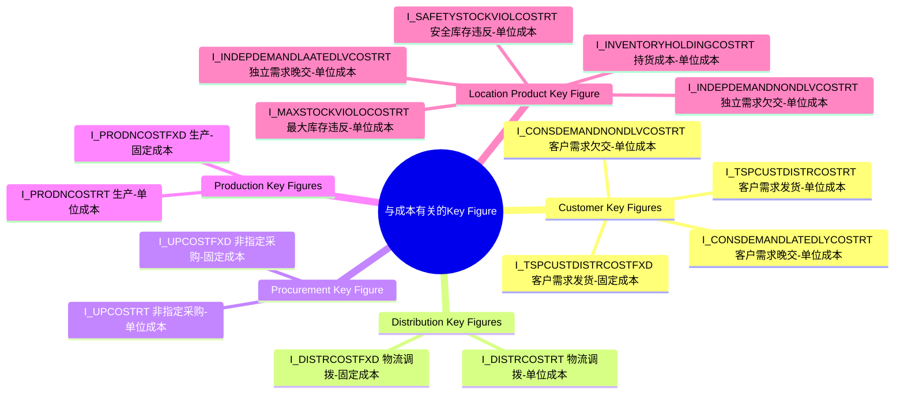

| **日期**      | **修订人** | **描述**            |
| ----------- | ------- | ----------------- |
| 2026年01月12日 | 区卓挥     | 创建，1.0-初始版        |
| 2026年02月26日 | 区卓挥     | 表设计表更，新增库存成本&违约罚金 |
| 2026年03月03日 | 区卓挥     | 修复了一些设计问题         |
| 2026年03月14日 | 区卓挥     | 新增库存资金占用成本、优化初始化交互、新增成本合计列 |

# 1. **需求概述**

## 1.1 背景及问题

### 1.1.1 背景

成本和利润的考量是S\&OP系统的设计核心之一。然而，当前成本模型过于复杂，不仅增加了用户理解和使用的难度，也导致后端数据处理与算法决策视角不一致，影响了系统的实用性和决策效果。

S\&OP系统本质上是基于有限资源约束的多路径优化决策系统。成本作为关键约束和目标函数，其模型设计应服务于"选择最优供应路径"这一核心决策。

### 1.1.2 问题

#### 1.1.2.1 成本项太冗余

目前S\&OP的成本明细结构沿用了传统成本会计的完整分解逻辑，包含：

* 完全成本、制造成本、变动成本、固定成本

* 直接材料、直接人工、直接能耗、期间费用

* 毛利、净利、单位边贡等利润指标


这将导致：

1. 用户理解成本高：非财务背景的业务用户难以准确区分和提供这些成本数据

2. 数据获取困难：企业在实操中难以按此颗粒度拆分成本，特别是"期间费用"分摊等

3. 决策信息过载：S\&OP只需关注"哪里获取最经济"，不需要知道"人工占多少、材料占多少"

#### 1.1.2.2 后端和算法割裂

当前系统存在两套割裂的成本视角：

* 后端数据层：按财务科目存储完整成本分解

* 算法决策层：算法实际只使用路径成本进行优化

目前S\&OP模块里，算法真正在考虑的成本是：

1. 制造成本：先从成本版本获取成本明细（CostDetail），然后根据成本计算方法配置：

   1. 变动成本法：使用成本明细的变动成本

   2. 固定成本法：使用成本明细的制造成本

2. 采购成本：与MPS一样，从采购路径上获取采购单价

3. 调拨成本：与MPS一样，从运输路径上获取运输单价

这种割裂将导致：

1. 数据处理冗余：存储了大量算法不需要的成本细节

2. 维护复杂度高：成本结构变更需要同步修改多套逻辑

3. 实施困难：实施顾问需要大量时间解释成本概念

4. 数据不一致：后端看到的成本和算法看到的成本不一致，导致结果不符合预期

## 1.2 目标

### 1.2.1 SAP IBP 成本模型的考虑范围

SAP IBP考虑的成本可大概分为库存持货成本、运输成本、采购成本、生产成本、需求欠交成本，共五大类。


原文描述：
You can define cost rules to be respected by the optimizer. In doing so, you can specify &#x20;

different time-independent cost values as follows:&#x20;

● Inventory cost values for selected location materials&#x20;

● Transportation and procurement cost values for selected transportation lanes&#x20;

● Production cost values for selected production data structures&#x20;

● Late delivery costs and non-delivery costs for selected demands


### 1.2.2 SAP IBP 成本模型的详细配置

SAP IBP 将数据模型拆分为**Master Data主数据**和**Key Figure关键指标。**

#### 1.2.2.1 **什么是Master Data？**

**Master Data**用于在IBP中定义“谁、在哪、什么东西”，是供应链规划的 “基本盘”，一旦定义完成，仅在业务架构调整时（如新增产品、拓展仓库）做少量维护，**变更频率极低**。

**IBP中核心的Master Data类型**

* **产品类**：产品、产品组、物料类型、规格属性（如尺寸 / 颜色）等；

* **位置类**：工厂、仓库、分销中心、客户位置、供应链网络层级等；

* **合作伙伴类**：供应商、客户、经销商等；

* **资源类**：产线、设备、运输资源等；

* **时间类**：规划周期（日 / 周 / 月 / 季）、节假日等；

* **其他维度**：渠道、销售组织、版本等。

**核心特性**：统一维护、全局复用、静态稳定、无计算衍生性，是所有Key Figure的 “依附维度”（没有主数据，Key Figure 就没有存在的意义）。

#### 1.2.2.2 什么是Key Figure？

**Key Figure**是 IBP 中**随业务运营、规划计算、场景模拟动态变化**的数值型数据，是规划的 “核心对象、计算结果、分析依据”**。简单来说，Key Figure 是**“多少量、多少钱、多少时间”，**是供应链计划的 “核心数值”，会随预测、订单、市场变化实时更新，变更频率极高，且所有 Key Figure 都**必须依附于一个或多个主数据维度存在。

**IBP中核心的Key Figure类型**

* **基础型**：实际销量、实际库存、采购订单量、生产计划量、原材料单价、单位制造成本等；

* **计算型**：安全库存、预测销量（基于算法计算）、库存持有成本、总物流成本、订单满足率等；

* **聚合型**：产品组月度总销量、全国仓库总库存、区域年度总成本等；

* **规划型**：需求预测值、供应计划量、预算成本、模拟场景下的预估利润等。

**核心特性**：维度依附、动态变化、参与计算、多版本 / 多场景存储，是 IBP 规划引擎、模拟分析、报表展示的**核心对象**。

#### 1.2.2.3 与成本有关的Key Figure

##### 1.2.2.3.1 Customer Key Figures

[**Non-Delivery Cost Rate for Customer Demand (I\_CONSDEMANDNONDLVCOSTRT)**](https://help.sap.com/docs/SAP_INTEGRATED_BUSINESS_PLANNING/c1fb60cb1e9c49d99ada277ae57e9e6c/295f3e803da048e78e2f53d483cfbd59.html?locale=en-US#non-delivery-cost-rate-for-customer-demand-\(i_consdemandnondlvcostrt\))

**含义：**&#x5BA2;户需求欠交-单位成本

**挂靠维度：**&#x54;echWeek – Product – TSP Customer – Demand Category（时段+物品+客户+需求类别）

**原文描述：**

This input key figure defines the cost for each unit of a customer demand (per period) that is not met by the supply plan (stored in the key figure **Customer Supply**). The total non-delivery costs are calculated by multiplying the non-delivery cost rate by the non-delivered quantity, that is, the difference between the **Customer Demand** and **Customer Supply** key figures. The total costs considered by the optimizer is therefore proportional to the difference between these key figures.

These costs should contain the revenue lost per product unit that cannot be delivered, but they can also contain additional non-delivery costs (for example, penalty costs that are incurred if a company’s brand is negatively impacted as the result of not fulfilling customer demands).


[**Late-Delivery Cost Rate for Customer Demand (I\_CONSDEMANDLATEDLYCOSTRT)**](https://help.sap.com/docs/SAP_INTEGRATED_BUSINESS_PLANNING/c1fb60cb1e9c49d99ada277ae57e9e6c/295f3e803da048e78e2f53d483cfbd59.html?locale=en-US#late-delivery-cost-rate-for-customer-demand-\(i_consdemandlatedlvcostrt\))

**含义：**&#x5BA2;户需求晚交-单位成本

**挂靠维度：**&#x54;echWeek – Product – TSP Customer – Demand Category（时段+物品+客户+需求类别）

**原文描述：**

You can use the **Late-Delivery Cost Rate for Customer Demand** input key figure to specify the cost rate for late deliveries (per unit of measure and period). These costs are incurred for any amounts that are delivered late in each period.

To avoid unnecessary late deliveries, you must fill this key figure accordingly. It is multiplied with the number of periods and the quantities that are delivered late to return the cost of the late deliveries.


[**Customer Distribution Cost Rate(I\_TSPCUSTDISTRCOSTRT)**](https://help.sap.com/docs/SAP_INTEGRATED_BUSINESS_PLANNING/c1fb60cb1e9c49d99ada277ae57e9e6c/295f3e803da048e78e2f53d483cfbd59.html?locale=en-US#customer-distribution-cost-rate-\(i_tspcustdistrcostrt\))

**含义：**&#x5BA2;户需求发货-单位成本

**挂靠维度：**&#x54;echWeek – Product – Location – TSP Customer – Mode of Transport（时段+物品+库存点+客户+运输模式）

**原文描述：**

This input key figure defines all costs that are proportional to the transport quantity of a product from a location to a customer. The transportation costs are defined per product unit and period for customer receipts.


[**Fixed Customer Distribution Cost (I\_TSPCUSTDISTRCOSTFXD)**](https://help.sap.com/docs/SAP_INTEGRATED_BUSINESS_PLANNING/c1fb60cb1e9c49d99ada277ae57e9e6c/295f3e803da048e78e2f53d483cfbd59.html?locale=en-US#fixed-customer-distribution-cost\(i_tspcustdistrcostfxd\))

**含义：**&#x5BA2;户需求发货-固定成本

**挂靠维度：**&#x54;echWeek – Product – Location – TSP Customer – Mode of Transport（时段+物品+库存点+客户+运输模式）

**原文描述：**

This input key figure models a fixed cost for each period in which the customer receipts for a product, customer, and (ship-from) location are not zero.


##### 1.2.2.3.2 Distribution Key Figures

[**Fixed Distribution Cost (I\_DISTRCOSTFXD)**](https://help.sap.com/docs/SAP_INTEGRATED_BUSINESS_PLANNING/c1fb60cb1e9c49d99ada277ae57e9e6c/7791596fc9f04c9b851a6eb9bda946b2.html?locale=en-US#fixed-distribution-cost-\(i_distrcostfxd\))

**含义：**&#x7269;流调拨-固定成本

**挂靠维度：**&#x44;ay – Product – Source Location – Location – Mode of Transport – Additional Lane ID（日+物品+来源库存点+目的库存点+运输模式+路径ID）

**原文描述：**

This input key figure models fixed costs for each period in which there is distribution supply for a transportation lane.


[**Distribution Cost Rate (I\_DISTRCOSTRT)**](https://help.sap.com/docs/SAP_INTEGRATED_BUSINESS_PLANNING/c1fb60cb1e9c49d99ada277ae57e9e6c/7791596fc9f04c9b851a6eb9bda946b2.html?locale=en-US#distribution-cost-rate-\(i_distrcostrt\))

**含义：**&#x7269;流调拨-单位成本

**挂靠维度：**&#x44;ay – Product – Source Location – Location – Mode of Transport – Additional Lane ID（日+物品+来源库存点+目的库存点+运输模式+路径ID）

**原文描述：**

This input key figure defines the variable cost rate per product unit and period for distribution supply in a transportation lane.


##### 1.2.2.3.3 Procurement Key Figure

[**Fixed Unspecified-Purchasing Cost (I\_UPCOSTFXD)**](https://help.sap.com/docs/SAP_INTEGRATED_BUSINESS_PLANNING/c1fb60cb1e9c49d99ada277ae57e9e6c/71bb32f7d6b14db2a47351b670af71b1.html?locale=en-US#fixed-unspecified-purchasing-cost-\(i_upcostfxd\))

**含义：**&#x975E;指定采购-固定成本

**挂靠维度：**&#x54;echWeek – Product – Location – Unspecified Purchasing（时段+物品+库存点）

**原文描述：**

This input key figure models a fixed cost for each period in which there is unspecified purchasing for a location product.


[**Unspecified-Purchasing Cost Rate (I\_UPCOSTRT)**](https://help.sap.com/docs/SAP_INTEGRATED_BUSINESS_PLANNING/c1fb60cb1e9c49d99ada277ae57e9e6c/71bb32f7d6b14db2a47351b670af71b1.html?locale=en-US#unspecified-purchasing-cost-rate-\(i_upcostrt\))

**含义：**&#x975E;指定采购-单位成本

**挂靠维度：**&#x54;echWeek – Product – Location – Unspecified Purchasing（时段+物品+库存点）

**原文描述：**

This input key figure defines the variable cost rate per product unit and period for unspecified purchasing for a location product.


##### 1.2.2.3.4 Production Key Figures

[**Fixed Production Cost (I\_PRODNCOSTFXD)**](https://help.sap.com/docs/SAP_INTEGRATED_BUSINESS_PLANNING/c1fb60cb1e9c49d99ada277ae57e9e6c/54cab3ca2fb1449c944fb0a1c951e771.html?locale=en-US#fixed-production-cost-\(i_prodncostfxd\))

**含义：**&#x751F;产-固定成本

**挂靠维度：**&#x44;ay – PDS（日+PDS）

**原文描述：**

This input key figure models fixed costs for each period in which there is production supply for a PDS.


[**Production Cost Rate (I\_PRODNCOSTRT)**](https://help.sap.com/docs/SAP_INTEGRATED_BUSINESS_PLANNING/c1fb60cb1e9c49d99ada277ae57e9e6c/54cab3ca2fb1449c944fb0a1c951e771.html?locale=en-US#production-cost-rate-\(i_prodncostrt\))

**含义：**&#x751F;产-单位成本

**挂靠维度：**&#x44;ay – PDS（日+PDS）

**原文描述：**

It models the cost per product unit and period for production receipts.


##### 1.2.2.3.5 Location Product Key Figure

[**Maximum Stock Violation Cost Rate (I\_MAXSTOCKVIOLOCOSTRT)**](https://help.sap.com/docs/SAP_INTEGRATED_BUSINESS_PLANNING/c1fb60cb1e9c49d99ada277ae57e9e6c/83f01bf1eefc42e3a96d92662e242866.html?locale=en-US#maximum-stock-violation-cost-rate-\(i_maxstockviolcostrt\))

**含义：**&#x6700;大库存违反-单位成本

**挂靠维度：**&#x44;ay – Product – Location（日+物品+库存点）

**原文描述：**

This input key figure defines the costs for each product unit and period that are incurred when the projected stock is above the maximum stock defined. These costs are typically entered as penalty costs; they do not reflect real costs.


[**Inventory Holding Cost Rate (I\_INVENTORYHOLDINGCOSTRT)**](https://help.sap.com/docs/SAP_INTEGRATED_BUSINESS_PLANNING/c1fb60cb1e9c49d99ada277ae57e9e6c/83f01bf1eefc42e3a96d92662e242866.html?locale=en-US#inventory-holding-cost-rate-\(i_inventoryholdingcostrt\))

**含义：**&#x6301;货成本-单位成本

**挂靠维度：**&#x44;ay – Product – Location（日+物品+库存点）

**原文描述：**

This input key figure defines the cost for inventory holding for each product unit and period. It is related to the key figure **I\_Projected Stock** (which denotes the amount of goods at the end of a given period).

To calculate the total cost of keeping the projected amount of products in stock, the **I\_Projected Stock** key figure for each period is multiplied by the **I\_Inventory Holding Cost Rate** key figure for each period. All costs that relate to inventory holding should be included in this key figure, that is, the capital costs as well as the costs of storage.


[**Safety Stock Violation Cost Rate (I\_SAFETYSTOCKVIOLCOSTRT)**](https://help.sap.com/docs/SAP_INTEGRATED_BUSINESS_PLANNING/c1fb60cb1e9c49d99ada277ae57e9e6c/83f01bf1eefc42e3a96d92662e242866.html?locale=en-US#safety-stock-violation-cost-rate-\(i_safetystockviolcostrt\))

**含义：**&#x5B89;全库存违反-单位成本

**挂靠维度：**&#x44;ay – Product – Location（日+物品+库存点）

**原文描述：**

This input key figure defines the costs for each product unit and period that are incurred when the projected stock is below the safety stock. These costs are typically entered as penalty costs; they do not reflect real costs.


[**Independent Demand Non-Delivery Cost Rate (I\_INDEPDEMANDNONDLVCOSTRT)**](https://help.sap.com/docs/SAP_INTEGRATED_BUSINESS_PLANNING/c1fb60cb1e9c49d99ada277ae57e9e6c/83f01bf1eefc42e3a96d92662e242866.html?locale=en-US#independent-demand-non-delivery-cost-rate-\(i_indepdemandnondlvcostrt\))

**含义：**&#x72EC;立需求欠交-单位成本

**挂靠维度：**&#x54;echWeek – Product – Location（时段+物品+库存点）

**原文描述：**

This input key figure is relevant only if the **I\_Independent Demand** key figure (I\_INDEPDEMAND) contains values. If additional demand for a location product is defined in the **Independent Demand** key figure, the optimizer uses the **Independent Demand Non-Delivery Cost Rate** key figure to calculate penalty costs for non-delivered quantities (by multiplying the value for the **Independent Demand Non-Delivery Cost Rate** key figure with the non-delivered quantity).


[**Late-Delivery Cost Rate for Independent Demand (I\_INDEPDEMANDLAATEDLVCOSTRT)**](https://help.sap.com/docs/SAP_INTEGRATED_BUSINESS_PLANNING/c1fb60cb1e9c49d99ada277ae57e9e6c/83f01bf1eefc42e3a96d92662e242866.html?locale=en-US#late-delivery-cost-rate-for-independent-demand-\(i_indepdemandlatedlvcostrt\))

**含义：**&#x72EC;立需求晚交-单位成本

**挂靠维度：**&#x54;echWeek – Product – Location（时段+物品+库存点）

**原文描述：**

You can use the **Late-Delivery Cost Rate for Independent Demand** input key figure to specify the cost rate for late deliveries (per unit of measure and period). These costs are incurred for any amounts that are delivered late in each period.

To avoid unnecessary late deliveries, you must fill this key figure accordingly. It is multiplied with the number of periods and the quantities that are delivered late to return the cost of the late deliveries.


##### 1.2.2.3.6 总览图




### 1.2.3 SAP IBP 成本维护页面


### 1.2.4 SAP IBP 成本底表设计

[SAP\_IBP\_COST\_VERSION.xlsx](files/S\&OP-成本模型改造-PRD-SAP_IBP_COST_VERSION.xlsx)


# 2. **详细解决方案**

## 2.1 全局参数改造

### 2.1.1 **模块描述**

用于实现售价获取和成本初始化的可配置性

### 2.1.2 **输入**

#### 2.1.2.1 新增参数

全局参数中新增以下参数：

* 原始售价明细的生成范围（只生成需求物品的售价明细）

* 初始化时生产成本的取值来源（库存点物品/物品候选资源）

* 初始化时采购成本的取值来源（库存点物品/采购路径）

* 初始化时运输成本的取值来源（库存点物品/运输路径）

* 库存点物品的库存持有成本（启用/禁用）

* 库存点物品的最大库存违反成本（启用/禁用）

* 库存点物品的库存资金占用成本（启用/禁用）

* 默认资金占用成本率（年化）（百分比，默认值0%）

* 客户的单位欠交罚金（启用/禁用）

* 客户的单位晚交罚金（启用/禁用）

#### 2.1.2.2 复用字段

复用以下字段scope\_code，字段值存储各模块名称，以英文逗号分隔，以实现各参数在各模块的显示控制。上述新增参数的scope\_code先填'S\&OP'。

### 2.1.3 **输出**

无

### 2.1.4 **业务流程**

全局参数的应用对象是场景，在开始制定计划前应提前配置好全局参数。

### 2.1.5 **业务规则**

详情见2.2.5的业务规则部分。

### 2.1.6 **原型图**

[全局参数.html](files/S\&OP-成本模型改造-PRD-全局参数.html)

#### 2.1.6.1 整体UI

左侧是参数类别，右侧是该类别下的具体参数。


#### 2.1.6.2 搜索框

支持模糊搜索


#### 2.1.6.3 参数提示和悬停提示

参数下方会附带小字提示，提示该参数的大致作用；选项右侧会附带问号的悬停提示，提示每一种选项的预期效果。


#### 2.1.6.4 scope\_code

用scope\_code标识参数的所属模块，只有所属模块才能看见该参数。当某个模块完全不需要用到某个参数类别下的任意参数，则该类别在该模块的全局参数页面中不会显示。

例如SCH不需要用到成本设置里的任何参数，则在SCH模块的全局参数页面中看不见成本设置这一类别。

### 2.1.7 **测试用例**

[全局参数-测试用例.md](files/S\&OP-成本模型改造-PRD-全局参数-测试用例.md)


## 2.2 **成本模型改造**

### 2.2.1 **模块描述**

包含“财务版本”、“售价明细”、“成本明细”，作为算法和统计报表的输入。

全局参数的配置将影响售价明细和成本明细的原始数据生成逻辑。

当基础数据发生变更时，可在原版本中重新生成新版的售价明细和成本明细，或另外新建版本存储。

### 2.2.2 **输入**

#### 2.2.2.1 全局参数

获取全局参数中关于成本的参数配置。

#### 2.2.2.2 建立销售部门和客户的关联关系

dps\_ord\_customer

1. 新增“所属销售部门”字段，关联mds\_sal\_sales\_segment的id字段，建立销售部门和客户的关联关系。（新增、修改、导入时必填）

2. 新增“折扣率”字段（新增、修改、导入时非必填，默认1）

#### 2.2.2.3 财务版本&#x20;

成本版本sop\_pla\_cost\_version重构，重构为财务版本sop\_pla\_finance\_version，可参考：

```sql
CREATE TABLE `sop_pla_finance_version` (
  `id` varchar(64) CHARACTER SET utf8mb4 COLLATE utf8mb4_bin NOT NULL COMMENT '主键ID',
  `version_name` varchar(100) CHARACTER SET utf8mb4 COLLATE utf8mb4_bin DEFAULT NULL COMMENT '版本名称',
  `version_status` varchar(30) CHARACTER SET utf8mb4 COLLATE utf8mb4_bin DEFAULT 'CREATE' COMMENT '版本状态',
  `start_date` datetime DEFAULT NULL COMMENT '开始日期',
  `end_date` datetime DEFAULT NULL COMMENT '结束日期',
  `currency_unit_id` varchar(64) CHARACTER SET utf8mb4 COLLATE utf8mb4_bin DEFAULT NULL COMMENT '货币单位id',
  `remark` varchar(255) CHARACTER SET utf8mb4 COLLATE utf8mb4_bin DEFAULT NULL COMMENT '备注',
  `validated` varchar(30) CHARACTER SET utf8mb4 COLLATE utf8mb4_bin DEFAULT 'NO' COMMENT '是否校验通过',
  `creator` varchar(64) CHARACTER SET utf8mb4 COLLATE utf8mb4_bin NOT NULL COMMENT '创建人',
  `create_time` datetime NOT NULL COMMENT '创建时间',
  `modifier` varchar(64) CHARACTER SET utf8mb4 COLLATE utf8mb4_bin NOT NULL COMMENT '修改人',
  `modify_time` datetime NOT NULL COMMENT '修改时间',
  PRIMARY KEY (`id`) USING BTREE,
  UNIQUE KEY `version_name` (`version_name`) USING BTREE
) ENGINE=InnoDB DEFAULT CHARSET=utf8mb4 COLLATE=utf8mb4_bin COMMENT='财务版本';
```

需要支持新增、修改、删除、全量/增量导入

导入模板支持编辑的字段有：'版本名称'、'版本状态'、'开始日期'、'结束日期'、'备注'。

#### 2.2.2.4 售价明细

销售价sop\_pla\_cost\_sale重构，可参考：

```sql
CREATE TABLE sop_pla_finance_price_header (
  id                   varchar(64)  PRIMARY KEY,
  version_id           varchar(64)  NOT NULL COMMENT '财务版本id',
  stock_point_id       varchar(64)  NOT NULL COMMENT '库存点id',
  product_id           varchar(64)  NOT NULL COMMENT '物品id',
  customer_id          varchar(64)  NOT NULL COMMENT '客户id',
  start_time           datetime     NOT NULL COMMENT '开始时间',
  end_time             datetime     NOT NULL COMMENT '结束时间',
  enabled              varchar(64)  DEFAULT 'YES' COMMENT '是否启用',
  creator              varchar(64),
  create_time          datetime,
  modifier             varchar(64),
  modify_time          datetime,
  UNIQUE KEY uk_price_hdr (version_id, stock_point_id, product_id, customer_id, start_time, end_time)
) ENGINE=InnoDB DEFAULT CHARSET=utf8mb4 COMMENT='售价明细头';
```

```sql
CREATE TABLE sop_pla_finance_price_line (
  id                      varchar(64)  PRIMARY KEY,
  header_id               varchar(64)  NOT NULL COMMENT '头表id，FK->price_header.id',

  price_type              varchar(32)  NOT NULL DEFAULT 'STANDARD' COMMENT '价格策略: STANDARD/PROMOTION/TIERED/SEASONAL 等，预留扩展',

  product_stock_point_id  varchar(64)  DEFAULT NULL COMMENT '库存点物品id',
  sale_orgnization_id     varchar(64)  DEFAULT NULL COMMENT '销售部门id',
  base_price              decimal(14,4) DEFAULT NULL COMMENT '基础售价',
  discount_rate           decimal(14,4) DEFAULT 1 COMMENT '折扣率',
  final_price             decimal(14,4) DEFAULT NULL COMMENT '最终售价',
  remark                  varchar(255) DEFAULT NULL,

  creator                 varchar(64),
  create_time             datetime,
  modifier                varchar(64),
  modify_time             datetime,

  CONSTRAINT fk_price_line_header
    FOREIGN KEY (header_id) REFERENCES sop_pla_finance_price_header(id),

  UNIQUE KEY uk_price_line (header_id, price_type, COALESCE(product_stock_point_id, ''), COALESCE(sale_orgnization_id, ''))
) ENGINE=InnoDB DEFAULT CHARSET=utf8mb4 COMMENT='售价明细行';
```

需要支持新增、修改、删除、全量/增量导入、导出。

导出导入共用一套模板，字段有：'版本名称'、'库存点代码'、'物品代码'、'销售部门代码'、'客户代码'、'基础售价'、'折扣率'、'最终售价'、'开始时间'、'结束时间'、'备注'，以支持导出修改后再导入的操作。

#### 2.2.2.5 成本明细

采购价sop\_pla\_cost\_purchase重构，可参考：

```sql
CREATE TABLE sop_pla_finance_cost_header (
  id                   varchar(64)  PRIMARY KEY,
  version_id           varchar(64)  NOT NULL COMMENT '财务版本id',
  stock_point_id       varchar(64)  NOT NULL COMMENT '库存点id',
  product_id           varchar(64)  NOT NULL COMMENT '物品id',
  product_stock_point_id varchar(64) DEFAULT NULL COMMENT '库存点物品id',
  start_time           datetime     NOT NULL COMMENT '开始时间',
  end_time             datetime     NOT NULL COMMENT '结束时间',
  enabled              varchar(64)  DEFAULT 'YES' COMMENT '是否启用',
  remark               varchar(255) DEFAULT NULL,
  creator              varchar(64),
  create_time          datetime,
  modifier             varchar(64),
  modify_time          datetime,
  UNIQUE KEY uk_cost_hdr (version_id, stock_point_id, product_id, start_time, end_time)
) ENGINE=InnoDB DEFAULT CHARSET=utf8mb4 COMMENT='成本明细头';
```

```sql
CREATE TABLE sop_pla_finance_cost_line (
  id              varchar(64) PRIMARY KEY,
  header_id       varchar(64) NOT NULL COMMENT '头表id，FK->cost_header.id',

  cost_category   varchar(32) NOT NULL COMMENT '成本大类: PRODUCTION/PURCHASE/TRANSPORT/INVENTORY/PENALTY',
  metric_type     varchar(32) NOT NULL COMMENT '度量类型: UNIT/FIXED/VIOLATION/HOLDING/LATE_PENALTY/NON_DELIVERY',

  -- 明确业务维度（可空）
  standard_resource_id   varchar(64) DEFAULT NULL COMMENT '生产资源id',
  purchase_routing_id    varchar(64) DEFAULT NULL COMMENT '采购路径id',
  transport_routing_id   varchar(64) DEFAULT NULL COMMENT '运输路径id',
  source_stock_point_id  varchar(64) DEFAULT NULL COMMENT '运输来源库存点id',
  customer_id            varchar(64) DEFAULT NULL COMMENT '客户id',

  cost_value      decimal(14,4) NOT NULL DEFAULT 0 COMMENT '成本值',
  time_cost_uom   varchar(32)   DEFAULT NULL COMMENT '时间成本单位(DAY/WEEK/MONTH)',
  remark          varchar(255)  DEFAULT NULL,

  creator         varchar(64),
  create_time     datetime,
  modifier        varchar(64),
  modify_time     datetime,

  CONSTRAINT fk_cost_line_header
    FOREIGN KEY (header_id) REFERENCES sop_pla_finance_cost_header(id),

  -- 保证同一维度下一个度量仅一条记录
  UNIQUE KEY uk_cost_dim (
    header_id,
    cost_category,
    metric_type,
    COALESCE(standard_resource_id, ''),
    COALESCE(purchase_routing_id, ''),
    COALESCE(transport_routing_id, ''),
    COALESCE(source_stock_point_id, ''),
    COALESCE(customer_id, '')
  )
) ENGINE=InnoDB DEFAULT CHARSET=utf8mb4 COMMENT='成本明细行';
```

* **生产成本** &#x20;

  * 行：`cost_category='PRODUCTION'` &#x20;

    * 单位生产成本：`metric_type='UNIT'` + `standard_resource_id` &#x20;

    * 固定生产成本：`metric_type='FIXED'` + `standard_resource_id`

* **采购成本** &#x20;

  * 行：`cost_category='PURCHASE'` &#x20;

    * 单位/固定采购成本：`metric_type='UNIT'/'FIXED'` + `purchase_routing_id`

* **运输成本** &#x20;

  * 行：`cost_category='TRANSPORT'` &#x20;

    * 单位/固定运输成本：`metric_type='UNIT'/'FIXED'` + `transport_routing_id` + `source_stock_point_id`

* **库存成本** &#x20;

  * 行：`cost_category='INVENTORY'` &#x20;

    * 单位最大库存违反成本：`metric_type='VIOLATION'` &#x20;

    * 库存持有成本：`metric_type='HOLDING'`

    * 资金占用成本率（年化）：`metric_type='CAPITAL_OCCUPATION'`

* **违约罚金** &#x20;

  * 行：`cost_category='PENALTY'` &#x20;

    * 单位晚交罚金：`metric_type='LATE_PENALTY'` + `customer_id` &#x20;

    * 单位欠交罚金：`metric_type='NON_DELIVERY'` + `customer_id`

* 如何实现可扩展？核心在于「维度固定 + 枚举扩展」这两个点：

  * 维度固定在头表，头表只负责你前端已经稳定下来的公共维度：版本、库存点、物品、时间段、货币等。这些维度基本不会因为新增一种成本类别而改变，所以头表结构长期稳定。

  * 行表通过枚举来表达“是什么成本 + 针对谁”：

    * cost\_category：表示成本大类，例如现在有：PRODUCTION / PURCHASE / TRANSPORT / INVENTORY / PENALTY。将来要加“能耗成本”，只需要新增一个枚举值 ENERGY 即可。

    * metric\_type表示该大类下的具体度量项，例如现在有：UNIT、FIXED、VIOLATION、HOLDING、LATE\_PENALTY、NON\_DELIVERY。将来能耗里需要“电费单价/固定电费/碳排放成本”，就新增 ENERGY\_UNIT、ENERGY\_FIXED、CARBON\_COST 等枚举。

    * 维度字段（standard\_resource\_id / purchase\_routing\_id / transport\_routing\_id / source\_stock\_point\_id / customer\_id）是可选的，只在对应的大类中使用；如果未来某个新类别需要新的维度，比如「生产线」维度：可以在行表中新增 production\_line\_id 列，只让 cost\_category='ENERGY' 的行填值即可。


此外，还需要支持新增、修改、删除、全量/增量导入、导出模板/所有。

导入模板示例：

1. 头维度（公共）

* 版本编码（必填）

* 库存点编码（必填）

* 物品编码（必填）

* 开始时间（必填）

* 结束时间（必填）

* 货币编码（必填）

- 业务分类字段

* 成本大类（必填，枚举：生产/采购/运输/库存成本/违约罚金，或用代码 PRODUCTION 等）

* 成本度量类型（必填，枚举：单位成本/固定成本/违反成本/持有成本/单位晚交罚金/单位欠交罚金，对应后端的 UNIT/FIXED/…）

- 维度字段（按大类选择性填写）

* 生产资源编码（仅生产成本）

* 采购路径编码（仅采购成本）

* 运输路径编码（仅运输成本）

* 来源库存点编码（仅运输成本）

* 客户编码（仅违约罚金）

- 度量字段

* 成本值（必填）

* 时间成本单位（仅库存持有成本需要，如 DAY/HOUR）

- 其他

* 备注

#### 2.2.2.6 删除成本版本明细

删除成本版本明细sop\_pla\_cost\_detail的系统菜单页面、底表、前端代码、后端代码。


### 2.2.3 **输出**

无

### 2.2.4 **业务流程**

#### 2.2.4.1 配置财务版本

1. 配置全局参数

2. 创建财务版本

#### 2.2.4.2 配置售价明细

1. 在售价明细中点击【生成】

2. 修改数据，提供两种修改方式：

   1. 双击单元格修改数据，点击【保存】

   2. 导出数据，修改后增量导入更新数据

#### 2.2.4.3 配置成本明细

1. 在成本明细中点击【生成】

2. 修改数据，提供两种修改方式：

   1. 双击单元格修改数据，点击【保存】

   2. 导出数据，修改后增量导入更新数据

#### 2.2.4.4 计划版本关联财务版本

在创建计划版本时，要选择关联的财务版本。

#### 2.2.4.5 初始化按钮交互流程

适用于售价明细和成本明细各TAB（生产成本、采购成本、运输成本、库存成本、违约罚金）的初始化按钮。

**场景A：用户勾选了部分数据**

1. 用户勾选部分数据后点击【初始化】
2. 直接弹出"确认初始化"弹窗（第二层）
3. 弹窗内容：初始化操作将覆盖现有数据，建议先导出保存副本。初始化范围：已勾选X条数据。确认执行初始化吗？
4. 按钮：取消、确认初始化

**场景B：用户未勾选任何数据**

1. 用户未勾选任何数据直接点击【初始化】
2. 先弹出"全量初始化警告"弹窗（第一层）
3. 弹窗内容：您未勾选任何数据，将对当前TAB的所有数据执行初始化操作。是否继续？
4. 按钮：取消、继续
5. 用户点击【继续】后，弹出"确认初始化"弹窗（第二层）
6. 弹窗内容：初始化操作将覆盖现有数据，建议先导出保存副本。初始化范围：当前TAB全部数据。确认执行初始化吗？
7. 按钮：取消、确认初始化

### 2.2.5 **业务规则**

#### 2.2.5.1 原始数据生成逻辑

##### 2.2.5.1.1 时间

财务版本、售价明细、成本明细的开始结束时间要和系统时段的开始结束时间匹配上。

##### 2.2.5.1.2 售价明细

**若“原始售价明细的生成范围=只生成需求物品的售价明细”：**

1. 查询需求表，获取所有需求的**库存点物品-客户**组合，以及**需求交期**

2. 查询时段表，获取**需求交期所处的系统时段**

3. 查询客户表，获取**客户-销售部门-折扣率**

4. 查询库存点物品表，获取**库存点物品-售价（作为基础售价，空为0）**

笛卡尔积，2 X 3 X 4，形成原始售价明细数据

##### 2.2.5.1.3 成本明细-生产成本

**若“初始化时生产成本的取值来源=库存点物品”：**

1. 查询时段表，获取**系统现有时段**

2. 查询物品候选资源表，获取**库存点物品-标准资源**

3. 查询库存点物品表，获取**库存点物品-单位生产成本、固定生产成本（空为0）**

笛卡尔积，1 X (2 ← 3)，形成生产成本原始数据

**若“初始化时生产成本的取值来源=物品候选资源”：**

1. 查询时段表，获取**系统现有时段**

2. 查询物品候选资源表，获取**库存点物品-标准资源-单位生产成本、固定生产成本（空为0）**

笛卡尔积，1 X 2，形成生产成本原始数据

##### 2.2.5.1.4 成本明细-采购成本

**若“初始化时采购成本的取值来源=库存点物品”：**

1. 查询采购路径表，获取**采购路径-库存点物品-供应商-生效时间-失效时间**

2. 查询库存点物品表，获取**库存点物品-单位采购成本、固定采购成本（空为0）**

1 ← 2，形成采购成本原始数据

**若“初始化时采购成本的取值来源=采购路径”：**

1. 查询采购路径表，获取**采购路径-库存点物品-供应商-单位采购成本、固定采购成本（空为0）-生效时间-失效时间**

直接形成采购成本原始数据

##### 2.2.5.1.5 成本明细-运输成本

**若“初始化时运输成本的取值来源=物品”：**

1. 查询运输路径表，获取**运输路径-物品-来源库存点-目标库存点-生效时间-失效时间**

2. 查询物品表，获取**物品-单位运输成本、固定运输成本（空为0）**

1 ← 2，形成运输成本原始数据

**若“初始化时运输成本的取值来源=运输路径”：**

1. 查询运输路径表，获取**运输路径-物品-来源库存点-目标库存点-单位运输成本、固定运输成本（空为0）-生效时间-失效时间**

直接形成运输成本原始数据

##### 2.2.5.1.6 成本明细-库存成本

**若“库存点物品的库存持有成本=启用”：**

1. 查询时段表，获取**系统现有时段**

2. 查询库存点物品表，获取**库存点物品-单位库存持有成本（空为0）**

笛卡尔积，1 X 2，形成库存成本原始数据

**若“库存点物品的最大库存违反成本=启用”：**

1. 查询时段表，获取**系统现有时段**

2. 查询库存点物品表，获取**库存点物品-单位最大库存违反成本（空为0）**

笛卡尔积，1 X 2，形成库存成本原始数据

**若"库存点物品的库存资金占用成本=启用"：**

1. 查询时段表，获取**系统现有时段**

2. 查询库存点物品表，获取**库存点物品**

3. 查询全局参数，获取**默认资金占用成本率（年化）**

笛卡尔积，1 X 2，资金占用成本率默认填充全局参数值，形成库存成本原始数据

##### 2.2.5.1.7 成本明细-违约罚金

**若“客户的单位欠交罚金=启用”：**

1. 查询时段表，获取**系统现有时段**

2. 查询需求表，获取所有需求的**库存点物品-客户**组合

3. 查询客户表，获取**客户-销售部门-单位欠交罚金（空为0）**

笛卡尔积，1 X (2 ← 3)，形成违约罚金原始数据

**若“客户的单位晚交罚金=启用”：**

1. 查询时段表，获取**系统现有时段**

2. 查询需求表，获取所有需求的**库存点物品-客户**组合

3. 查询客户表，获取**客户-销售部门-单位晚交罚金（空为0）**

笛卡尔积，1 X (2 ← 3)，形成违约罚金原始数据

##### 2.2.5.1.8 货币单位

1. 售价和成本的货币单位跟随财务版本的货币单位

2. 财务版本的货币单位非必填，若新增/修改财务版本时未填写，则取单位表中的**默认**货币单位。（若单位表无默认货币单位，则提示报错）


#### 2.2.5.2 数据校验逻辑

##### 2.2.5.2.1 时间

财务版本、售价明细、成本明细的时段要和系统时段严格匹配。

##### 2.2.5.2.2 时段完整

假设当前系统有12个时段，若某个成品在12个时段均有售价数据，则该成品的售价是“时段完整”的。

##### 2.2.5.2.3 售价明细

**若“原始售价明细的生成范围=只为需求生成相应的售价明细”：**

1. 检查是否有需求无法匹配任何一条售价明细，有一条就**错误数+1**

2. 检查各需求的成品在需求交期时段是否有售价明细，缺就**错误数+1**

3. 检查各需求成品的售价明细的基础售价、折扣率、最终售价是否有0值/空值，有一个就**警告数+1**

4. 除了备注、基础售价、折扣率、最终售价，检查当前数据是否有其它字段值为空，有一个空值就记录**错误数+1**

##### 2.2.5.2.4 成本明细-生产成本

1. 检查是否存在物品候选资源里的某一个“库存点物品+标准资源”组合无法匹配任何一条生产成本明细，有一个就**错误数+1**

2. 检查物品候选资源的各个“库存点物品+标准资源”组合是否时段完整，缺一个时段就**警告数+1**

3. 若全局参数里“库存点物品的库存持有成本=启用”，检查各个“库存点物品+标准资源”组合的单位生产成本是否有0值/空值，有一个就**警告数+1**

4. 除了备注、单位生产成本、固定制造成本，检查当前数据是否有其它字段值为空，有一个空值就记录**错误数+1**

##### 2.2.5.2.5 成本明细-采购成本

1. 检查当前数据（除备注列外）是否有字段值为空，有一个空值就记录**错误数+1**

2. 检查是否存在采购路径表的某一条采购路径无法匹配任何一条采购成本明细，有一条就**错误数+1**

3. 对于每一条采购路径，对比它在采购路径表的<u>“生效时间~失效时间”</u>和在采购成本明细的<u>“时段”</u>，缺时段就**错误数+1**

##### 2.2.5.2.6 成本明细-运输成本

1. 检查当前数据（除备注列外）是否有字段值为空，有一个空值就记录**错误数+1**

2. 检查是否存在运输路径表的运输路径无法匹配任何一条运输成本明细，有一条就**错误数+1**

3. 对于每一条运输路径，对比它在运输路径表的<u>“生效时间~失效时间”</u>和在运输成本明细的<u>“时段”</u>，缺时段就**错误数+1**

##### 2.2.5.2.7 成本明细-库存成本

1. 检查是否存在库存点物品无法匹配任何一条库存成本明细，有一条就**错误数+1**

2. 检查各个库存点物品的库存成本明细是否时段完整，缺一个时段就**警告数+1**

3. 若全局参数里“库存点物品的库存持有成本=启用”，检查单位库存持有成本是否有0值/空值，有一个就记录**错误数+1**

4. 若全局参数里”库存点物品的库存点物品的最大库存违反成本=启用”，检查单位最大库存违反成本是否有0值/空值，有一个空值就记录**错误数+1**

5. 若全局参数里”库存点物品的库存资金占用成本=启用”，检查资金占用成本率是否有空值，有一个空值就记录**错误数+1**

6. 除了备注、单位库存持有成本、单位最大库存违反成本、资金占用成本率，检查当前数据是否有其它字段值为空，有一个空值就记录**错误数+1**

##### 2.2.5.2.8 成本明细-违约罚金

1. 检查是否存在需求无法匹配任何一条违约罚金，有一条就**错误数+1**

2. 检查各个需求在其交期所在时段是否存在违约罚金，不存在就**错误数+1**

3. 若全局参数里“客户的单位欠交罚金=启用”，检查单位欠交罚金是否有0值/空值，有一个就记录**错误数+1**

4. 若全局参数里“客户的单位晚交罚金=启用”，检查单位晚交罚金是否有0值/空值，有一个就记录**错误数+1**

5. 除了备注、单位欠交罚金、单位晚交罚金，检查当前数据是否有其它字段值为空，有一个空值就记录**错误数+1**

##### 2.2.5.2.9 校验结果

整体校验结果呈现在弹窗里，详细校验结果可以下载为excel文件，具体弹窗UI见原型图的数据校验按钮。

#### 2.2.5.3 算法输入组装

在运行算法时，将计划版本关联的财务版本的售价明细和成本明细组装成新的csv文件，算法以这两个csv文件为准。

#### 2.2.5.4 算法计算逻辑

**1. PURCHASE_FIXED_COST（固定采购成本）**

按次计费，只要发起一次采购行为（生成采购计划）就产生固定成本，与采购数量无关。

计算公式：`采购固定成本 = 采购次数 × 固定成本值`

**2. PURCHASE_UNIT_COST（单位采购成本）**

按件计费，采购总成本随采购数量线性变化。

计算公式：`采购单位成本 = 采购数量 × 单位成本值`

**3. PRODUCTION_FIXED_COST（固定生产成本）**

按次计费，只要启用一次生产作业（启动生产线/设备）就产生固定成本，与生产产量无关。

计算公式：`生产固定成本 = 生产次数 × 固定成本值`

**4. PRODUCTION_UNIT_COST（单位生产成本）**

按件计费，生产总成本随产量线性变化。

计算公式：`生产单位成本 = 生产数量 × 单位成本值`

**5. TRANSPORT_FIXED_COST（固定运输成本）**

按次计费，只要发起一次运输行为（生成运输计划）就产生固定成本，与运输数量无关。

计算公式：`运输固定成本 = 运输次数 × 固定成本值`

**6. TRANSPORT_UNIT_COST（单位运输成本）**

按件计费，运输总成本随运输量线性变化。

计算公式：`运输单位成本 = 运输数量 × 单位成本值`

**7. MAXIMUM_VIOLATION_UNIT_COST（单位最大库存违反成本）**

当库存数量超过预设的最大库存限额时，按超限数量计费。

计算公式：`最大库存违反成本 = MAX(0, 实际库存 - 最大库存限额) × 单位违反成本值`

**8. HOLDING_TIME_COST（库存持有成本）**

按库存持有时长计费，成本总额随持有时间线性变化。

计算公式：`库存持有成本 = 库存量 × 成本率 × 时间系数`

- **成本率**：成本明细中的 cost_value
- **时间系数**：根据 time_cost_uom 和系统时段计算
  - `time_cost_uom='DAY'`，系统时段为月 → 时间系数 = 该月天数（28/29/30/31）
  - `time_cost_uom='WEEK'`，系统时段为月 → 时间系数 = 该月天数 ÷ 7
  - `time_cost_uom='MONTH'`，系统时段为月 → 时间系数 = 1

示例：cost_value=0.5元/天，期末库存=100件，3月（31天）→ 100 × 0.5 × 31 = 1,550元

**9. LATE_DELIVERY_UNIT_COST（单位晚交罚金）**

因未能按时向客户交付货物，按延期交付数量计费。

计算公式：`晚交罚金 = 延期交付数量 × 单位晚交罚金值`

**10. NON_DELIVERY_UNIT_COST（单位欠交罚金）**

因完全无法向客户交付货物，按未交付数量计费。

计算公式：`欠交罚金 = 未交付数量 × 单位欠交罚金值`

**11. CAPITAL_OCCUPATION_COST（库存资金占用成本）**

按库存价值和资金占用成本率计费，反映库存占用资金的机会成本。

计算公式：`库存资金占用成本 = 平均库存价值 × 资金占用成本率（年化） × 时间系数`

- **平均库存价值**：`(期初库存 + 期末库存) / 2 × 单位价值`
- **资金占用成本率**：优先使用成本明细中的值，若无则使用全局参数默认值
- **单位价值获取优先级**：
  1. 售价（从售价明细，同一时间多行取平均）
  2. 单位生产成本（从成本明细-生产成本）
  3. 单位采购成本（从成本明细-采购成本）
  4. 若都无，记录警告并跳过该库存点物品
- **时间系数**：
  - 系统时段为月：1/12
  - 系统时段为周：1/52
  - 系统时段为日：1/365

示例：资金占用成本率=5%（年化），平均库存=100件，单位价值=50元，系统时段为月 → 100 × 50 × 5% × (1/12) = 20.83元

#### 2.2.5.5 统计分析报表

未改造，但计划版本的收入、利润、成本等统计分析报表均要以关联的财务版本的售价明细和成本明细为准。

### 2.2.6 **原型图**

<span style="color: inherit; background-color: rgba(254,212,164,0.8)">原型图</span> <span style="color: inherit; background-color: rgba(254,212,164,0.8)">html</span> <span style="color: inherit; background-color: rgba(254,212,164,0.8)">文件，可下载并在浏览器中直接打开查看效果：</span>

[财务管理.html](files/S\&OP-成本模型改造-PRD-财务管理.html)

**本次更新涉及的原型图变更：**

1. **全局参数**：新增"库存点物品的库存资金占用成本"启用开关和"默认资金占用成本率（年化）"参数，当默认值为0%时弹窗提示建议配置
2. **成本明细-库存成本TAB**：新增"资金占用成本率（年化）"列，新增"库存成本合计"列（= 单位最大库存违反成本 + 库存持有成本，不含资金占用成本率）
3. **成本明细-生产成本TAB**：新增"生产成本合计"列（= 单位生产成本 + 固定生产成本）
4. **成本明细-采购成本TAB**：新增"采购成本合计"列（= 单位采购成本 + 固定采购成本）
5. **成本明细-运输成本TAB**：新增"运输成本合计"列（= 单位运输成本 + 固定运输成本）
6. **成本明细-违约罚金TAB**：新增"违约罚金合计"列（= 单位晚交罚金 + 单位欠交罚金）
7. **售价明细和成本明细各TAB的初始化按钮**：新增两层弹窗交互（未勾选数据时先弹全量警告，再弹确认；已勾选数据时直接弹确认）

#### 2.2.6.1 整体UI

* **一级主标签**：页面顶部为三个主标签 —— **财务版本** | **售价明细** | **成本明细**，切换即切换主内容区。

* **统一入口**：三个模块集成于同一页面「财务版本与成本管理」，共用顶部面包屑与主题样式（浅蓝色 `#0284c7`）。

* **数据关联**：售价明细、成本明细均依赖「财务版本」；二者顶栏均有**财务版本**下拉，用于按版本筛选数据。下拉选项来源于财务版本列表，仅展示**版本名称**（不含备注）。

#### 2.2.6.2 财务版本


##### 2.2.6.2.1 整体UI

* **顶栏**：筛选（展开/收起）、新增版本、导入、导出、视图设置。按钮尺寸偏小，与筛选区紧凑排列。

* **筛选面板**（默认收起，点击「筛选」展开）：

  * 版本名称（文本）

  * 版本状态（下拉：全部 / 创建 / 已发布 / 已归档）

  * 开始日期、结束日期（日期选择器）

  * **查询**、**重置**与筛选条件同区域展示。

* **数据表格**：

  * 列：勾选、版本名称、版本状态、开始日期、结束日期、备注、创建人、创建时间、修改人、修改时间、操作。

  * 操作列：编辑、删除。

  * 表格区域有最大高度限制，超出可纵向滚动。

* **弹窗**：

  * **新增/编辑**：版本名称（必填）、版本状态、开始日期、结束日期、备注；取消、保存。

  * **导入**：导入方式（全量 / 增量）、文件选择（.xlsx / .xls / .csv）；取消、确认导入。

  * **视图设置**：见下文「功能描述」。

##### 2.2.6.2.2 功能描述

* **CRUD**：新增、编辑、删除财务版本；表格行勾选可多选，当前设计未对多选做批量操作，仅作预留。

* **筛选**：按版本名称、状态、开始/结束日期快速筛选；查询、重置。

* **导入**：支持全量（清空后导入）、增量（追加）；Excel / CSV。

* **导出**：导出当前列表（含筛选结果）为文件。

* **视图设置**（三 Tab）：

  * **筛选**：多规则组合（字段、运算符、值类型、值、且/或），可增删、拖拽排序。

  * **排序**：多规则（字段、升/降序），可增删、拖拽排序。

  * **列设置**：列顺序拖拽调整、列宽设置。

  * 设置可保存，下次进入时恢复。

##### 2.2.6.2.3 交互描述

* 点击「筛选」展开/收起筛选面板；查询、重置仅作用于快捷筛选条件。

* 视图设置中的「筛选」「排序」为**高级**规则，与顶栏快捷筛选可并存；列表展示 = 先快捷筛选，再应用视图设置中的筛选与排序。

* 新增/编辑提交后关闭弹窗、刷新表格，并可选同步更新售价/成本模块的「财务版本」下拉数据源。

* 删除前需二次确认。


#### 2.2.6.3 售价明细


##### 2.2.6.3.1 整体UI

* **顶栏**：

  * 左侧：财务版本下拉（必选以筛选数据）。

  * 右侧：未保存提示（「\*」「更改待保存」）、**初始化**、保存、导入、导出、视图设置。保存按钮默认禁用，有待保存修改时高亮可点。

* **筛选与操作**：筛选、全部展开、全部折叠、新增、批量编辑。筛选面板含：库存点代码、物品代码、销售部门 ID、客户 ID、时间范围；查询、重置。

* **数据表格**：

  * 列：勾选、物品代码、库存点、版本、时段、销售部门、客户 ID、基础售价、折扣率、最终售价、货币、备注、操作。

  * **数值列**（基础售价、折扣率、最终售价）使用不同样式标签区分（灰 / 黄 / 绿），带边框与背景。

  * **时段**：单列展示，格式为 `开始日期~结束日期`（如 `01/01~03/31`），不拆成开始、结束两列。

  * 操作列：每行编辑、删除（删除为行内图标按钮，无顶栏批量删除）。

* **分组与分页**：

  * 按**库存点 + 物品 + 版本 + 客户**分组；每组为父行，可展开/折叠。

  * 父行展示组键信息及子行条数；展开后先展示**组内平均**行（基础售价、折扣率、最终售价的组内平均值，保留两位小数），再展示子行。

  * 分页按**父行（组）数量**分页，每页条数可选（如 10 / 20 / 50）。表格高度固定，纵向滚动，底部预留分页栏。

* **弹窗**：

  * **新增/编辑**：物品、库存点、版本、时段（开始/结束）、销售部门、客户、基础售价、折扣率、最终售价、货币、备注等。

  * **批量编辑**：按**销售部门**分组展示已选记录；组内可按「统一赋值」对基础售价、折扣率、最终售价批量填写；支持多组分别编辑。

  * **导入**：全量/增量、文件选择；格式同财务版本。

  * **视图设置**：筛选、排序、列设置（同财务版本结构）。

##### 2.2.6.3.2 功能描述

* **按版本筛选**：财务版本切换后立即筛选并刷新列表，无需切到其他主标签再切回。

* **CRUD**：新增、编辑、删除（行内）；表格行与父行勾选。父行勾选即勾选该组全部子行；**不允许跨版本多选**批量编辑，若已选多版本需提示。

* **行内编辑**：**折扣率**、**最终售价**支持双击进入编辑；二者联动：

  * 改折扣率 → `最终售价 = 基础售价 × 折扣率`（保留两位小数）；

  * 改最终售价 → `折扣率 = 最终售价 / 基础售价`（保留两位小数）。

* **更改待保存**：行内或批量编辑后，涉及修改的单元格可标「\*更改待保存」；保存按钮高亮可点，保存后清除标记并刷新。

* **批量编辑**：多选后按销售部门分组，组内按时段排序；每组可「统一赋值」联动同组同字段；确认后写回数据、标记待保存、刷新表格。

* **初始化**：预留逻辑（如从版本/模板初始化售价）；有未保存修改时建议提示。

* **导入 / 导出 / 视图设置**：与财务版本类似；视图设置按模块独立保存。

##### 2.2.6.3.3 交互描述

* 父行点击展开/折叠；点击组内复选框仅勾选，不触发展开。全部展开、全部折叠作用于当前页所有组。

* 组内排序：先按**销售部门**升序，再按**时段**升序。

* 数值与金额**统一保留两位小数**（含折扣率、最终售价及联动计算、组内平均）。

* 取消编辑（如 Esc）恢复原值；提交（Enter / 失焦）生效并更新联动字段与待保存状态。

* 批量编辑前校验已选行是否同版本；若已选多版本，需提示并禁止打开批量编辑弹窗。

* 仅对**当前页的组**做展开/折叠；切换分页时展开状态可清空或按业务决定是否记忆。


#### 2.2.6.4 成本明细


##### 2.2.6.4.1 整体UI

* **顶栏**：与售价明细类似 —— 财务版本下拉、未保存提示、**初始化**、保存、导入、导出、视图设置。

* **筛选与操作**：筛选、全部展开、全部折叠、新增、批量编辑。筛选项含：库存点代码、物品代码、生产资源代码、采购路径代码、运输路径代码、时间范围、客户 ID；提供「查询」「重置」操作。

  * 成本筛选栏为**统一入口**，但每个字段只作用于拥有该字段的成本类型（见 4.3 功能说明）。

* **成本类型子标签**：五个 Tab —— **生产成本**、**采购成本**、**运输成本**、**库存成本**、**违约罚金**。各 Tab 独立表格与分页，但共用统一的筛选区域。

* **数据表格**（按 Tab 不同）：

  * **生产成本**：勾选、物品代码、库存点、版本、时段、生产资源代码、资源类别、**单位生产成本**、**固定生产成本**、货币、备注、操作。

  * **采购成本**：勾选、物品代码、库存点、版本、时段、采购路径代码、供应商、**单位采购成本**、**固定采购成本**、货币、备注、操作。

  * **运输成本**：勾选、物品代码、库存点、版本、时段、运输路径代码、来源库存点、**单位运输成本**、**固定运输成本**、货币、备注、操作。

  * **库存成本**（挂靠对象：**库存点物品**）：勾选、物品代码、库存点、版本、时段、**单位最大库存违反成本（MAXIMUM\_VIOLATION\_UNIT\_COST）**、**库存持有成本（HOLDING\_TIME\_COST）**、货币、备注、操作。

  * **违约罚金**（挂靠对象：**客户**）：勾选、物品代码、库存点、客户、版本、时段、**单位晚交罚金（LATE\_DELIVERY\_UNIT\_COST）**、**单位欠交罚金（NON\_DELIVERY\_UNIT\_COST）**、货币、备注、操作。

* **成本列样式**：使用不同颜色的标签表示不同成本类型（示例：生产黄、采购蓝、运输绿、库存成本黄褐、违约罚金粉），数值以圆角标签形式展示，可双击进入编辑；与保存按钮的「更改待保存」状态联动。

* **分组与分页**：

  * 生产成本 / 采购成本 / 运输成本：按**物品 + 库存点 + 版本**分组；分组行为父行，可展开/折叠。

  * **库存成本**：按**物品 + 库存点 + 版本**分组（挂靠库存点物品）。

  * **违约罚金**：按**客户 + 版本**分组（同一客户+版本下，可能有多条不同物品/库存点）。

  * 展开后先展示**组内平均**行（仅展示当前 Tab 对应的成本字段平均值，保留两位小数），再展示子行。

  * 分页按**父行（组）数**分页；**五个 Tab 分页互相独立**，切换 Tab 后各自保持页码、每页条数与展开状态。

* **固定高度与滚动**：表格区域高度固定，内部滚动，底部为分页栏与统计信息。

* **弹窗**：

  * 新增/编辑弹窗：按当前 Tab 显示/隐藏不同字段 —— 生产含固定生产成本，采购含固定采购成本，运输含固定运输成本，库存成本含单位最大库存违反成本与库存持有成本，违约罚金含物品、库存点、客户、单位晚交罚金、单位欠交罚金。

  * 批量编辑弹窗：按资源/路径/时段/库存点·物品/客户分组，每组有「统一赋值」开关；组内记录以卡片形式展示，右侧为可输入的批量成本字段。

  * 导入、视图设置弹窗：结构与售价明细保持一致。

##### 2.2.6.4.2 功能描述

* **按版本筛选**：财务版本切换后立即筛选并刷新当前 Tab 列表。

* **统一筛选规则**：

  * 公共条件（库存点代码、物品代码、时间范围）对所有成本类型生效。

  * 生产资源代码、采购路径代码、运输路径代码、客户 ID 等**仅在记录实际存在该字段时参与过滤**：

    * 例如：填写「采购路径」和「运输路径」，采购成本只有采购路径字段，因此只按采购路径过滤，不会因为没有运输路径字段而被清空；运输成本只按运输路径过滤。

    * 填写客户 ID 时，仅**违约罚金**按 `customer_id` 过滤，其它成本类型不受影响。

* **CRUD**：新增、编辑、删除（行内）；行勾选、组勾选。编辑弹窗字段依当前成本类型变化；库存成本挂靠库存点物品，违约罚金挂靠客户+物品+库存点。

* **行内编辑**：

  * 单位生产成本、固定生产成本、单位采购成本、固定采购成本、单位运输成本、固定运输成本、单位最大库存违反成本、库存持有成本、单位晚交罚金、单位欠交罚金支持双击编辑。

  * 编辑完成后，当前 Tab 的组内平均行将重新计算并实时更新；对应单元格标记为「更改待保存」，保存成功后清除标记。

* **批量编辑**：

  * 多选后按当前 Tab 分组：

    * 生产：按**生产资源**分组；

    * 采购：按**采购路径**分组；

    * 运输：按**运输路径**分组；

    * 库存成本：按**库存点·物品**分组；

    * 违约罚金：按**客户**分组。

  * 每个分组卡片右上角有「统一赋值」开关，开启后，组内对应字段输入联动；关闭时各行可独立填写。

  * 确认后写回数据、标记待保存、刷新表格，并更新组内平均。

* **初始化 / 导入 / 导出 / 视图设置**：

  * 初始化：按全局参数配置生成或重置指定版本的成本明细数据（虚拟逻辑，可对接后端）。

  * 导入 / 导出：与售价类似，支持 Excel/CSV；导入支持全量/增量模式。

  * 视图设置：每个模块单独维护筛选规则、排序规则、列顺序及列宽；保存后下次进入恢复。

##### 2.2.6.4.3 交互描述

* 父行点击展开/折叠；展开后显示组内平均行，折叠后不显示。展开/折叠后会重新渲染表格，并恢复当前 Tab 内所有勾选状态。

* **勾选与批量编辑**：

  * 子行勾选：高亮整行（含冻结列），可多选；再次点击取消勾选。

  * 父行复选框：勾选/取消将联动本组所有子行；部分子行选中时，父行为「半选」状态。

  * 顶部全选勾选框：仅作用于当前 Tab，勾选时选中当前 Tab 所有记录，取消时清空当前 Tab 的选择。

  * 不允许跨成本类型、跨版本混选进行批量编辑：若检测到不同版本，将提示并阻止打开批量编辑弹窗。

* **勾选状态保持**：

  * 各成本 Tab 内部分别维护一份选中行集合；在 Tab 间切换时，勾选状态会在各自 Tab 内持久保留。

  * 筛选（查询/重置）会清空当前 Tab 的选中行，避免旧选择影响新结果。

* **组内排序**：

  * 生产成本：生产资源代码升序 → 时段升序；

  * 采购成本：供应商升序 → 时段升序；

  * 运输成本：来源库存点升序 → 时段升序；

  * 库存成本：时段升序；

  * 违约罚金：时段升序。

* 数值**保留两位小数**；成本录入、批量编辑、组内平均及导出数据均统一精度。

* 切换成本类型 Tab 时，保留各 Tab 的分页、展开状态与勾选状态；首次进入某 Tab 可默认第一页、全部折叠。

* 各成本类型 Tab 列数不同（违约罚金多出物品代码、库存点等列），列宽、表头需分别适配。

* 行内编辑仅成本相关列可编辑；编辑前若有未保存修改，可提示用户先保存或放弃。

#### 2.2.6.5 实现注意事项

* **选中状态管理**：

  * 为避免不同 Tab 之间互相干扰，选中状态使用 `selectedRowsByTab[tab]` 按 Tab 维度管理，`selectedRows` 始终指向当前 Tab 的集合。

  * `updateCheckboxes()` 只在当前 Tab 的 tbody 范围内查找 `.row-checkbox` / `.group-checkbox`，防止跨 Tab 误更新。

* **父行 & 子行高亮一致性**：

  * 子行 `tr.selected` 与父行 `tr.group-header.selected` 使用相同背景色与 sticky 列背景，保证视觉连续。

  * 父行「半选」状态也高亮，便于用户感知当前组内有已选记录。

* **筛选逻辑的「字段存在才参与」约束**：

  * 实现时须保证：对某个字段的筛选条件，仅当记录存在该字段（不为 `null/undefined`）时才参与判断，避免因为某字段在本成本类型中不存在而把所有记录过滤掉。

* **组内平均与实时刷新**：

  * 行内编辑和批量编辑确认后，应重新计算当前 Tab 的组内平均并刷新表格；注意保持展开/折叠与选中状态不丢失。

* **模拟数据与真实数据对齐**：

  * 违约罚金示例数据中，为了便于前端展示，增加了 `product_id`、`stock_point_id` 字段；对接真实后端时，需确认业务上是否确实存在「客户+物品+库存点」维度，并按实际字段映射。

* **主题与表格**：主题色 `#0284c7`；表格斑马纹、悬停高亮、选中态需明显区分。

* **图标**：财务版本、售价、成本主标签与按钮图标保持统一语义。

* **弹窗**：居中蒙层；标题、关闭、主操作（保存/确认）位置统一；取消/关闭不提交。

* **轻提示**：成功 / 失败 / 警告等提示；短暂自动消失。

* **视图设置与列宽**：按模块分别保存，避免相互覆盖；列设置需与分页/筛选/分组逻辑兼容，不影响冻结列与选中样式。


### 2.2.7 **测试用例**

[财务管理-测试用例.md](files/S\&OP-成本模型改造-PRD-财务管理-测试用例.md)


# 3. 评审意见
