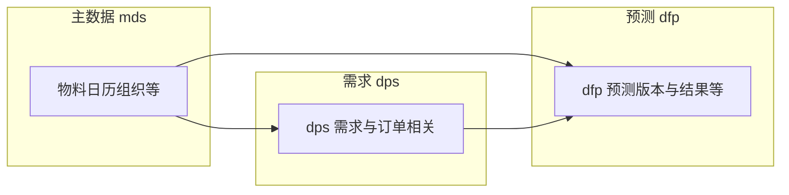

# DFP 模块 — 业务关联与 ER 说明

本文基于 `scp_dfp` 内表名前缀归纳**逻辑关联**；全量对象见 [01_表与视图清单.md](./01_表与视图清单.md)。库级外键见 [02_外键与引用关系.md](./02_外键与引用关系.md)（本环境未检出）。

## 1. 域划分（按前缀）

| 前缀族 | 在 `scp_dfp` 中的角色（概括） |
|--------|--------------------------------|
| `dfp_*` | 需求预测域：预测版本、结果、配置等与 DFP 服务直接相关的对象。 |
| `dps_*` | 需求计划侧输入与中间结果（与客户订单、预测需求等衔接，具体以表名为准）。 |
| `mds_*` | 主数据：物料、日历、组织等，为预测与计划提供维度。 |
| `sds_*` | 供需侧对象（本库内体量较大），与全链路供需、排程等能力衔接时需结合代码与场景数据源判断。 |

## 2. 逻辑链路（示意）

## 3. 与其它文档

- 知识库中其它模块若引用 **`scp_mps`** 等库做因子或字段核对，属于**跨库分析**，与「本目录对应的 `scp_dfp`」表全集不必一致。  
- 总览与 IPS 场景路由：[表设计_调研总览.md](../../表设计_调研总览.md)。
