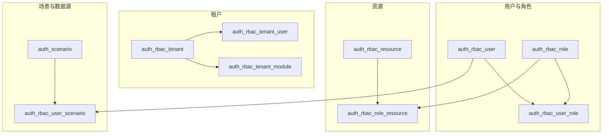

# IPS 模块 — 业务关联与 ER 说明

本文描述 `scp_ips` 内**常见逻辑关联**（不等同于 `02` 中的库级外键）。详细表清单见 [01_表与视图清单.md](./01_表与视图清单.md)。

## 1. 平台权限与场景（RBAC + 多租户）

- **租户**：`auth_rbac_tenant` 为租户主数据；`auth_rbac_tenant_module` 定义租户可用产品模块；`auth_rbac_tenant_user` 等关联用户与租户。
- **用户与角色**：`auth_rbac_user`、`auth_rbac_role`、`auth_rbac_user_role` 构成典型多对多；`auth_rbac_dept`、`auth_rbac_dept_user` 支持组织维度。
- **资源与授权**：`auth_rbac_resource` 为菜单/接口等资源树；`auth_rbac_module_resource`、`auth_rbac_role_resource` 将资源授权到角色；`auth_api_with_resource` 等表支撑 API 与资源绑定。
- **场景**：`auth_scenario` 描述业务场景实例及其 **数据源库名、连接信息**（字段如 `data_base_name` 等），`auth_rbac_user_scenario` 将用户授权到场景。这是 IPS **路由到 `scp_sds`、`scp_ams` 等各业务库** 的核心配置之一（跨库说明见 [表设计_调研总览.md](../../表设计_调研总览.md)）。

## 2. Flowable 流程引擎（`act_*` / `flw_*`）

- **定义与部署**：`act_re_deployment`、`act_re_procdef`、`act_ge_bytearray` 等保存流程定义与二进制内容；`act_de_model` 等与建模器相关。
- **运行时与历史**：`act_ru_execution`、`act_ru_task`、`act_ru_variable` 等为运行时表；`act_hi_*` 为历史表。
- **关联**：库级外键主要集中在 `act_*` 族内，见 [02_外键与引用关系.md](./02_外键与引用关系.md)。

## 3. 任务调度与运维

- **XXL-Job**：`xxl_job_info`、`xxl_job_log` 等与调度任务、执行日志相关；视图 `v_xxl_job_log` 便于查询展示。
- **长事务任务**：`ope_task_progress`、`ope_task_node_log` 等与平台侧任务进度、节点日志相关（具体业务含义以代码为准）。

## 4. 其他平台能力（摘记）

- **值集**：`collection_management`、`collection_value` 及视图 `v_collection_management`、`v_collection_value`。
- **OAuth2**：`oauth_clients`、`oauth_access_tokens`、`oauth_refresh_tokens` 等，外键见 `02`。
- **接口与审计**：`ext_api_*`、`sys_login_log`、`log_excel_import_log` 等支撑接口配置、登录与导入日志。
