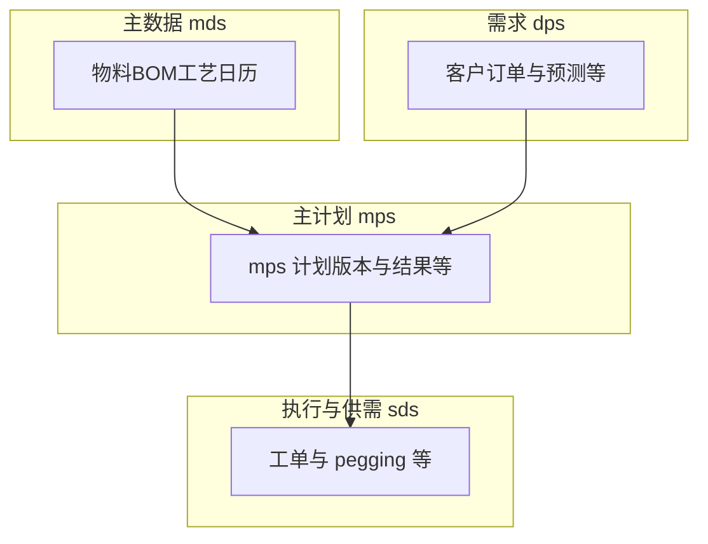

# MPS 模块 — 业务关联与 ER 说明

本文基于 `scp_mps` 内表名前缀归纳**逻辑关联**；全量对象见 [01_表与视图清单.md](./01_表与视图清单.md)。库级外键见 [02_外键与引用关系.md](./02_外键与引用关系.md)（本环境未检出）。

## 1. 域划分（按前缀）

| 前缀族 | 在 `scp_mps` 中的角色（概括） |
|--------|--------------------------------|
| `mps_*` | 主生产计划域：计划版本、工厂分配、排产结果等与 MPS 服务直接相关的对象。 |
| `dps_*` | 需求侧输入（客户订单、预测、净需求等），与 MPS 运算输入衔接。 |
| `mds_*` | 主数据：物料、BOM、工艺、日历等。 |
| `sds_*` | 供需与工单域对象，与计划下达、执行追溯等链路相关（具体以表名与代码为准）。 |

## 2. 逻辑链路（示意）

## 3. 与知识库其它文档

- [SDS/代码/SDS_需求优先级编码方案字段建议复核_代码实现.md](../../SDS/代码/SDS_需求优先级编码方案字段建议复核_代码实现.md) 等文档在核对因子来源时引用 **`scp_mps`** 中 `dps_*`、`mds_*` 等表或视图，可与本目录 `01` 对照阅读。  
- 总览：[表设计_调研总览.md](../../表设计_调研总览.md)。
