# 客户订单关联业务对象（归档调研）

## 数据源说明（scp_ams 已核对）

| 项 | 说明 |
|----|------|
| **梳理原则** | 凡与「客户订单」存在可追溯关联的业务数据（**含多跳、间接**，如经需求/供应/制造订单/工序/计划/产能/ATP 等链路），**均纳入**下列梳理；距离不设上限。 |
| **连接** | MCP `project-0-UHA-scp-test` → `10.7.60.157:3306`，库名 **`scp_ams`**；**2026-03-24** 已核对库结构并对非 `mds_*` 基表对照整理。 |
| **库形态** | **合一库**：同库含 `dps_*`、`sds_*`、`mds_*`、`ams_*` 等；**不含** `sop_*`、**不含** `mps_*`（工单下达需其它库或环境）。 |
| **与代码差异** | 代码里常见 `v_prs_peg_*`、`v_prs_ord_*`；**本库**供需为 **`sds_peg_*` / `v_sds_peg_*`**，工序投入产出等为 **`sds_ord_operation_*` / `v_sds_ord_*`**，以库为准。 |

---

## 流程关系图

含**主干链**与**多跳可达**对象（同一表在图中为概括节点，展开名见下节表）。

```mermaid
flowchart TB
  CO["客户订单\ndps_ord_customer_order"]
  CUST["客户\ndps_ord_customer"]

  subgraph PEG["供需 pegging"]
    DEM["需求\nv_sds_peg_demand"]
    FUL["供需关系\nv_sds_peg_fulfillment"]
    SUP["供应\nv_sds_peg_supply"]
    NET["净需求\nv_sds_peg_net_demand"]
  end

  subgraph DPSG["DPS 预测·优先级·净需求·抵消·库存点需求·安全库存"]
    DPSX["dps_for_demand_*\ndps_pri_*\ndps_net_*\ndps_off_*\ndps_sto_*"]
  end

  FBR["分工厂分BOM\nsds_dem_factory_bom_result"]

  WO["制造订单\nv_sds_ord_work_order"]
  WROUT["工艺路线头\nsds_ord_work_order_routing"]
  WOB["工单BOM\nv_sds_ord_work_order_bom"]
  STP["路线步骤\nv_sds_ord_work_order_routing_step"]
  OPMAT["工单物料\nsds_ord_order_material_*"]
  PU["计划单元\nv_sds_ord_plan_unit"]
  OP["工序\nv_sds_ord_operation"]

  subgraph OPRSUB["工序投入产出资源"]
    OPI["投入\nv_sds_ord_operation_input"]
    OPO["产出\nv_sds_ord_operation_output"]
    OPR["资源\nv_sds_ord_operation_resource"]
  end

  OPEX["工序扩展\ndetail / detail_info / extend\nful / task / subtask\npreferred_resource"]

  SCH1["工序排程\nv_sds_ope_operation_schedule"]
  SCH2["工序排程\nv_ams_ope_operation_schedule"]
  OPD1["工序计划明细\nv_sds_ope_operation_plan_detail"]
  OPD2["工序计划明细\nv_ams_ope_operation_plan_detail"]
  OIS["工序下达\nv_ams_ord_operation_issued"]
  OIV["工序下达版本\nv_ams_ord_operation_issued_version"]
  AMSOP["工序视图\nv_ams_ord_operation"]
  AMSLOG["排程日志\nams_log_schedule_operation_log"]
  AMSCFG["AMS 配置\nams_rul_task_drag\nams_timeline_config"]

  PO["采购订单\nv_sds_ord_purchase_order"]
  PUR["采购需求链\npurchase_demand*\nissued* / plan_demand*\npurchase_order_send\nauxiliary_*\npurchase_forecast_stock"]
  TO["运输订单\nv_sds_ord_transport_order"]
  BOH["BOH\nv_sds_sup_boh_stock"]
  BOHX["BOH 扩展\nboh_stock_mapping\nboh_stock_version"]

  ODSHUB["ATP·产能缺口·过点·通用供应\nods_atp_* · capa_* · dcp_*\nsds_supply_universal"]

  MSTR["主计划·产销平衡\nsds_ord_master_plan\nsds_order_main_*\nsds_pla_*"]
  SCHM["主排程\ndps_sch_master_production_schedule\nsds_sch_master_production_schedule"]

  FEE["履行反馈\nsds_fee_feedback_*"]
  KIT["齐套·C计划·冲压\nkitting_report*\ncplan_* / stamping_*"]
  PCAP["产能·PSI\nsds_product_capacity*\nsds_psi_psi"]
  STAT["交付统计\ndelivery_rate\ncategory_daily_output\nmonthly_category_forecast"]
  VEH["订单选装\nsds_ord_vehicle_option_mapping"]
  ISS["工单下达 MPS\n本库无 mps_* 表"]

  CO -->|customer_id| CUST
  CO --> DEM
  DEM --> FUL
  FUL --> SUP
  DEM --> NET
  CO --> DPSX
  DEM --> DPSX
  CO --> FBR
  SUP --> WO
  SUP --> PO
  SUP --> TO
  SUP --> BOH
  BOH --> BOHX
  PO --> PUR

  WO --> WROUT
  WO --> WOB
  WO --> STP
  WO --> OPMAT
  WO --> PU
  WO --> OP
  WO -.-> ISS

  OP --> OPI
  OP --> OPO
  OP --> OPR
  OP --> OPEX
  OP --> SCH1
  OP --> SCH2
  OP --> OPD1
  OP --> OPD2
  OP --> OIS
  OP --> AMSOP
  OIS --> OIV
  SCH2 --> AMSLOG
  SCH2 --> AMSCFG

  OP --> FEE
  PU --> FEE

  CO --> MSTR
  WO --> MSTR
  MSTR --> SCHM

  SUP --> ODSHUB
  WO --> ODSHUB
  CO --> ODSHUB

  CO --> KIT
  WO --> KIT
  OP --> PCAP
  CO --> STAT
  CO --> VEH
```



**基表与视图**：工序下达物理表为 **`ams_ord_operation_issued`**、**`ams_ord_operation_issued_version`**（`operation_id`、`order_id` 等，见库 DDL）。  

### scp_ams：可关联业务表（非 `mds_*` 基表）

与上图节点**一一对应展开**（基表名；同名 **`v_*` 视图一般存在**）。

| 类别 | 表名 |
|------|------|
| 客户（经订单 `customer_id`） | `dps_ord_customer` |
| 工单 / 工序扩展 | `sds_ord_work_order_routing`、`sds_ord_operation_detail`、`sds_operation_detail_info`、`sds_ord_operation_extend`、`sds_ord_operation_extend_copy1`、`sds_ord_operation_ful`、`sds_ord_operation_task`、`sds_ord_operation_sub_task`、`sds_ord_preferred_resource` |
| AMS 配置 | `ams_rul_task_drag`、`ams_timeline_config` |
| ATP / 产能占用（ODS） | `ods_atp_supply_capacity`、`ods_atp_supply_capacity_node`、`ods_atp_supply_capacity_occupied`、`ods_atp_supply_capacity_ratio` |
| 产能缺口 | `capa_capacity_gap`、`capa_capacity_gap_details` |
| 过点/传递 | `dcp_ord_passing_point_information` |
| 通用供应扩展 | `sds_supply_universal` |
| 主计划 / 产销平衡 | `sds_ord_master_plan`、`sds_order_main_plan`、`sds_order_main_version`、`sds_pla_master_production_plan`、`sds_pla_product_supply_demand`、`sds_pla_product_supply_demand_balance` |
| 主排程（DPS/SDS 各一份） | `dps_sch_master_production_schedule`、`sds_sch_master_production_schedule` |
| 采购需求与下达链 | `sds_ord_purchase_demand_order`、`sds_ord_purchase_demand_order_detail`、`sds_ord_issued_purchase_demand_order`、`sds_ord_purchase_plan_demand_order`、`sds_ord_purchase_order_send`、`sds_auxiliary_purchase_demand_master`、`sds_auxiliary_purchase_demand_detail`、`sds_sup_purchase_forecast_stock` |
| BOH 扩展 | `sds_sup_boh_stock_mapping`、`sds_sup_boh_stock_version` |
| 工单物料 | `sds_ord_order_material_master`、`sds_ord_order_material_detail` |
| 履行/反馈（与工序、计划单元等） | `sds_fee_feedback_operation`、`sds_fee_feedback_plan_unit`、`sds_fee_feedback_production`、`sds_fee_feedback_picking`、`sds_fee_feedback_stocking` |
| 齐套 / C 计划 / 专项 | `sds_ord_kitting_report_main`、`sds_ord_kitting_report_detail`、`sds_ord_cplan_original_sales_forecast`、`sds_ord_cplan_sales_forecast`、`sds_ord_cplan_split_sales_forecast`、`sds_cplan_cus_mapping`、`sds_stamping_production_plan` |
| 产能与 PSI 等 | `sds_product_capacity`、`sds_product_capacity_jph`、`sds_psi_psi` |
| 统计类（与需求/交付相关） | `sds_delivery_rate`、`sds_category_daily_output`、`sds_monthly_category_forecast` |
| 其它订单扩展 | `sds_ord_vehicle_option_mapping` |
| DPS：预测 / 优先级 / 净需求 / 抵消 / 库存点需求与安全库存 | `dps_for_demand_forecast`、`dps_for_demand_forecast_version`、`dps_for_demand_constraint`、`dps_for_demand_plan_operation_record`、`dps_for_demand_priority_result`、`dps_pri_demand_priority`、`dps_pri_priority_plan`、`dps_pri_priority_factor_config`、`dps_net_netting_rule`、`dps_net_netting_rule_planning`、`dps_off_offset_rule`、`dps_off_offset_detail`、`dps_sto_stock_point_demand`、`dps_sto_stock_point_demand_ratio`、`dps_sto_safety_stock`、`dps_sto_safety_stock_config`、`dps_sto_safety_coefficient` |

**未列**：`mds_*`（主数据域，单表数量大）；`sds_ord_test_order_vacancy` 等明显测试用途对象。

---

## 关联说明（仅字段）

- **客户订单 — 客户**：`customer_id` → `dps_ord_customer.id`。
- **客户订单 — 需求**：`demand_order_id` = 客户订单 `id`；`demand_type` = 客户订单需求类型。
- **需求 — 供需关系 / 供应**：`demand_id`、`supply_id`（列名以 DDL 为准）。
- **需求 — 净需求**：`sds_peg_net_demand` / `v_sds_peg_net_demand` 与需求侧主键或业务键关联（以 DDL 为准）。
- **客户订单 — 分工厂分 BOM 结果**：`order_id` / `order_ids` → 客户订单 `id`。
- **客户订单 — 制造 / 采购 / 运输 / BOH**：**需求 → 供需关系 → 供应** + 供应类型与目标单主键；可供需表递归。
- **客户订单 / 需求 — DPS（预测·优先级·净需求·抵消·库存点需求·安全库存）**：多经 `product_id`、`stock_point_id`、需求/计划侧主键等与 `dps_for_demand_*`、`dps_pri_*`、`dps_net_*`、`dps_off_*`、`dps_sto_*` 互指（以 DDL 为准）。
- **制造订单 — 工单 BOM / 工艺路线头 / 路线步骤 / 计划单元 / 工序**：`work_order_id` = 制造订单 `id`；路线步骤表另以 **`routing_id` / 路线头主键** 与 **`sds_ord_work_order_routing`** 衔接（以 DDL 为准）。
- **制造订单 — 工单物料**：主从表以 **`work_order_id` / `order_id`** 等与制造订单衔接（以 DDL 为准）。
- **工序 — 投入 / 产出 / 资源**：`operation_id` = 工序 `id`。
- **工序 — 扩展（detail / detail_info / extend / ful / task / subtask / preferred_resource）**：**`operation_id`**、部分表另含 **`work_order_id`**（以 DDL 为准）。
- **制造订单 — 工单下达（MPS）**：`work_order_id`；**本库无 `mps_*` 表**，具体列以 MPS 所在库 DDL 为准。
- **工序 — 排程（SDS / AMS）**：指向 **工序 `id` / 制造订单 `id`**（以 `v_sds_ope_operation_schedule`、`v_ams_ope_operation_schedule` 定义为准）。
- **工序 — 计划明细（SDS / AMS）**：父键指向 **排程或工序**（`v_sds_ope_operation_plan_detail`、`v_ams_ope_operation_plan_detail`，以 DDL 为准）。
- **工序 — 工序下达**：基表 **`ams_ord_operation_issued`**（**`operation_id`**、**`order_id`** 等）；**`ams_ord_operation_issued_version`** 以 **`version_id` / 下达主键** 与下达头互指；视图 **`v_ams_ord_operation_issued`**、**`v_ams_ord_operation_issued_version`**。
- **工序视图**：**`v_ams_ord_operation`** 与 **`sds_ord_operation`** 同源展示关系以视图定义为准。
- **排程 — 日志**：**`ams_log_schedule_operation_log`** 指向 **排程或任务侧主键**（以 DDL 为准）。
- **排程 — AMS 配置**：**`ams_rul_task_drag`**、**`ams_timeline_config`** 与排程/资源/场景 id 类字段关联（以 DDL 为准）。
- **采购订单 — 采购需求链**：**`purchase_order_id`、需求单 `id`、明细父键** 等串联 `purchase_demand*`、`issued*`、`purchase_plan_demand*`、`purchase_order_send`、`auxiliary_*`、`purchase_forecast_stock`（以 DDL 为准）。
- **BOH — BOH 扩展**：**`sds_sup_boh_stock_mapping`**、**`sds_sup_boh_stock_version`** 以 **BOH 主表主键 / 库存点 / 版本号** 等与 **`sds_sup_boh_stock`** 衔接（以 DDL 为准）。
- **客户订单 / 制造订单 / 供应 — ATP·产能缺口·过点·通用供应**：**`ods_atp_*`** 多经 **占用对象 id（需求/订单/资源维度）**；**`capa_capacity_gap*`** 与 **能力/物料/期间键**；**`dcp_ord_passing_point_information`** 与 **过点业务主键**；**`sds_supply_universal`** 与 **供应侧主键**（均以 DDL 为准）。
- **客户订单 / 制造订单 — 主计划·产销·平衡**：**`sds_ord_master_plan`、`sds_order_main_*`、`sds_pla_*`** 以 **`order_id` / `master_plan_id` / `product_id` / `stock_point_id` / 计划版本 id** 等与订单或需求体系衔接（以 DDL 为准）。
- **主计划域 — 主排程**：**`dps_sch_master_production_schedule`**、**`sds_sch_master_production_schedule`** 与 **主计划或计划版本主键** 关联（以 DDL 为准）。
- **工序 / 计划单元 — 履行反馈**：**`sds_fee_feedback_*`** 以 **`operation_id`、`plan_unit_id`** 等与工序/计划单元衔接（以 DDL 为准）。
- **制造订单 / 客户订单 — 齐套·C 计划·冲压**：**`kitting_report*`** 以 **齐套主键 + 订单/物料键**；**`cplan_*`** 以 **预测/计划 id + 客户或产品维度键**；**`sds_stamping_production_plan`** 以 **计划/订单侧主键**（均以 DDL 为准）。
- **工序 / 产品 / 资源 — 产能·PSI**：**`sds_product_capacity*`**、**`sds_psi_psi`** 以 **`product_id` / `operation_id` / `resource_id`** 等（以 DDL 为准）。
- **客户订单 / 组织·产品·期间 — 交付统计**：**`sds_delivery_rate`、`sds_category_daily_output`、`sds_monthly_category_forecast`** 以 **统计维度键** 与订单链弱关联或可经需求/发运数据对齐（以 DDL 为准）。
- **客户订单 — 选装映射**：**`sds_ord_vehicle_option_mapping`** 以 **`order_id` / 业务订单键** 与客户订单或下游工单衔接（以 DDL 为准）。

未写死的字段名请以库表 DDL 为准。

---

## 附录：在 scp_ams 中自查表清单

```sql
SELECT TABLE_NAME, TABLE_TYPE
FROM information_schema.TABLES
WHERE TABLE_SCHEMA = 'scp_ams'
  AND TABLE_TYPE IN ('BASE TABLE', 'VIEW')
ORDER BY TABLE_NAME;

SELECT TABLE_NAME
FROM information_schema.TABLES
WHERE TABLE_SCHEMA = 'scp_ams'
  AND (
    LOWER(TABLE_NAME) LIKE '%ope%'
    OR LOWER(TABLE_NAME) LIKE '%operation%'
    OR LOWER(TABLE_NAME) LIKE '%schedule%'
  )
ORDER BY TABLE_NAME;
```
