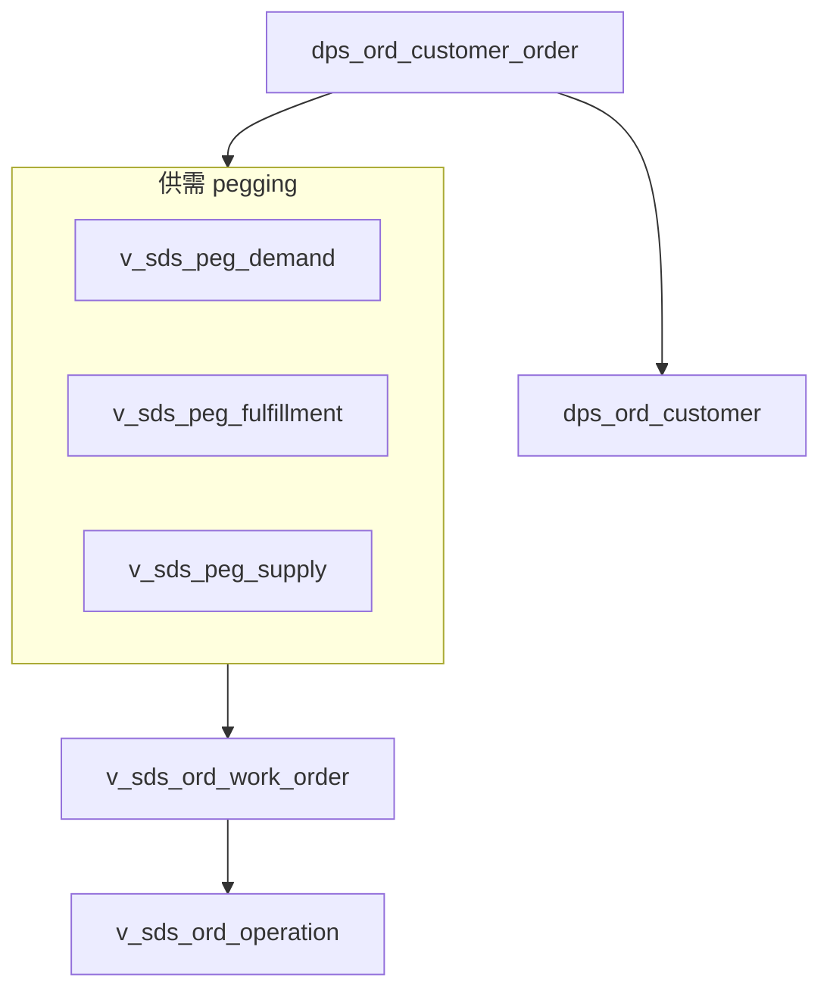

# SCH 模块 — 业务关联与 ER 说明

知识库目录 **SCH** 对应测试库 **`scp_ams`**（高级排程 / AMS）。本文件补充「排程视角」下的域划分；**客户订单多跳关联、表名与视图清单级梳理**请以 [客户订单关联业务数据表分析.md](../客户订单关联业务数据表分析.md) 为主，并与本目录 [01_表与视图清单.md](./01_表与视图清单.md) 对照。

## 1. 合一库与前缀域

`scp_ams` 为**合一库**，同一 schema 内主要前缀包括：

| 前缀族 | 说明 |
|--------|------|
| `mds_*` | 主数据（物料、日历、组织等），与 `scp_sds` 中同类前缀表**命名体系一致**，但数据实例随场景库不同而不同。 |
| `dps_*` | 需求与计划侧输入（预测、客户订单、优先级等）。 |
| `sds_*` | 供需 pegging、制造订单、工序、计划单元等执行与追溯对象。 |
| `ams_*` | 排程领域相对「专属」的少量表（本测试中数量较少，见 `01` 中 `ams_*` 分组）。 |
| `ods_*`、`mrp_*` 等 | 订单服务、MRP 相关扩展对象，需结合具体部署与代码引用理解。 |

库级外键：本测试库 **未在元数据中检出** 外键，见 [02_外键与引用关系.md](./02_外键与引用关系.md)。

## 2. 与客户订单 / pegging 主干（精简图）

下列与归档文档一致，便于从「排程 + 履约」视角定位对象（节点名为表或视图概括，展开见客户订单文档）。

## 3. 与 `scp_sds`、IPS 场景的关系

- **`scp_ams` 与 `scp_sds`**：表命名结构相近，但是 **两个独立 schema**；应用通过 IPS **场景**（`scp_ips.auth_scenario` 等）选择当前业务数据源，**不存在**跨这两个库的 MySQL 外键。
- 详细跨库逻辑索引见 [表设计_调研总览.md](../../表设计_调研总览.md)。
