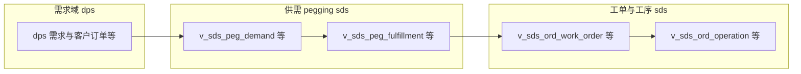

# SDS 模块 — 业务关联与 ER 说明

本文基于 `scp_sds` 内**表名前缀与领域常识**归纳逻辑关联；**非穷举字段级 ER**。全量对象列表见 [01_表与视图清单.md](./01_表与视图清单.md)。本库未登记库级外键，见 [02_外键与引用关系.md](./02_外键与引用关系.md)。

## 1. 域划分（按前缀）

| 前缀族 | 典型含义 | 说明 |
|--------|----------|------|
| `mds_*` | 主数据 | 物料、组织、日历、单位、工艺等主数据，为计划与供需计算提供维度与约束。 |
| `dps_*` | 需求与计划输入 | 需求预测、客户/订单相关需求、优先级与净需求等（具体子域以表名为准）。 |
| `sds_*` | 供需与制造订单 | pegging（供需追溯）、制造订单、工序、计划单元等，与排程/ATP 链路强相关。 |
| `v_*` / `vi_*` | 视图 | 多为上述基表的聚合或脱敏查询层，供应用只读访问。 |
| 其他 | `component_*`、`log_*`、`undo_*` 等 | 平台或横切能力，体量较小。 |

## 2. 逻辑链路（示意）

从「需求侧」到「制造与供应」的常见抽象链路如下（表名随项目版本可能演进，以库中实际对象为准）：

- **需求对象**：`dps_*` 中客户、订单、预测等表与视图。
- **供需追溯**：`sds_peg_*` / `v_sds_peg_*` 一类对象表达需求与供应的匹配关系（与 SCH 知识库中 `scp_ams` 描述类似，但 **schema 为 `scp_sds`**）。
- **制造订单与工艺**：`sds_ord_*` / `v_sds_ord_*` 表达工单、工艺路线、工序及投入产出等。

## 3. 与知识库其他文档的关系

- 产品知识库中 SDS 相关**代码调研**曾引用 **`scp_mps`** 等库做字段核对（例如需求优先级因子来源），属于**跨库/跨场景**分析，不等同于本库 `scp_sds` 的表全集。阅读时请区分「文档中引用的库名」与「本目录对应的 `scp_sds`」。
- 与 **`scp_ams`** 的结构相似性与场景切换，见 [表设计_调研总览.md](../../表设计_调研总览.md)。
