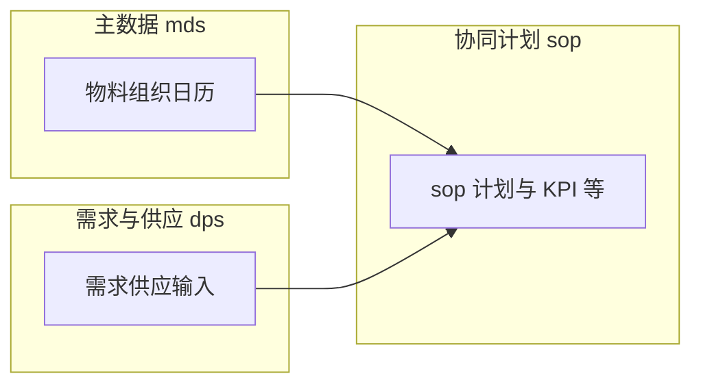

# SOP 模块 — 业务关联与 ER 说明

本文基于 `scp_sop` 内表名前缀归纳**逻辑关联**；全量对象见 [01_表与视图清单.md](./01_表与视图清单.md)。库级外键见 [02_外键与引用关系.md](./02_外键与引用关系.md)（本环境未检出）。

## 1. 域划分（按前缀）

| 前缀族 | 在 `scp_sop` 中的角色（概括） |
|--------|--------------------------------|
| `sop_*` | 产销协同计划域：S&OP 版本、供需平衡、KPI 与报表相关配置及结果等（以具体表名为准）。 |
| `dps_*` | 需求与供应侧输入数据，与协同计划运算衔接。 |
| `mds_*` | 主数据：物料、组织、日历等。 |
| `sds_*` | 供需与执行侧对象，用于协同视图与与下游计划衔接。 |
| `mrp_*` | 少量 MRP 相关扩展表，需结合版本与代码引用理解。 |

## 2. 逻辑链路（示意）

## 3. 与其它文档

- 产品能力边界：[技术协议功能调研/03_SOP计划与报表管理.md](../../技术协议功能调研/03_SOP计划与报表管理.md)。  
- IPS 场景与多库路由：[表设计_调研总览.md](../../表设计_调研总览.md)。
