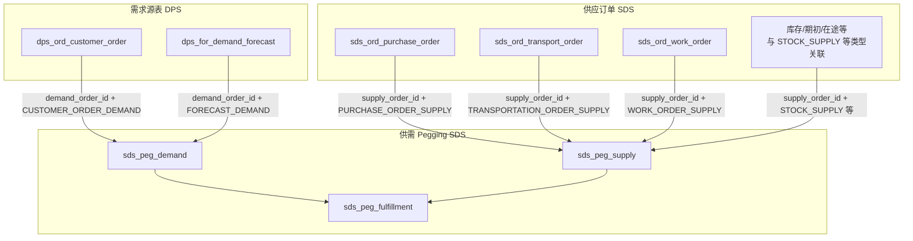

# 数据对象关系调研：需求对象 · 供需关系 · 供应对象（表级）

**文档位置**：`产品设计/产品知识库/_通用/`  
**调研日期**：2026-04-07  
**范围**：以**业务库中的表 / 视图为分析对象**，梳理「需求源表 → Pegging 需求/供应/分配 → 四类供应订单表」之间的**逻辑数据关系**（非穷举字段级 ER）。  
**依据**：`scp-foundation` 中 SDS/DPS 订单与 Pegging 相关实现；产品知识库各模块 `表设计/01_表与视图清单.md`、`SDS/表设计/03_业务关联与 ER 说明.md`、`SCH/代码/客户订单关联业务数据表分析.md` 等。

**说明**：各场景下物理库可能为 `scp_sds`、`scp_ams`、`scp_mps` 等合一或分库形态；**表名在多数场景一致**，行级数据是否同源取决于 IPS 场景与数据源配置。字段名、是否库级外键**以目标环境 DDL 为准**。

---

## 1. 概念与三层对象

| 层次 | 含义（产品语言） | 在本系统中的主要落表 |
|------|------------------|------------------------|
| **需求对象** | 产生「要货」的业务单据（客户要货、预测要货） | `dps_*` 域订单/预测表 |
| **供需关系（Pegging）** | 将「需求行」与「供应行」建立数量与时间上的匹配/分配 | `sds_peg_demand`、`sds_peg_supply`、`sds_peg_fulfillment` |
| **供应对象** | 可用来满足需求的供应来源：采购、运输、制造、库存（及在途等扩展） | `sds_ord_*` 订单表 + Pegging 中 `supply_type` 为库存类等 |

补充：净需求、冲减结果等常落在 **`sds_peg_net_demand`**（及对应视图），与上述三张 Pegging 表同属供需计算链路，本文在「扩展关联」中简述。

---

## 2. 需求对象：两张源表

用户所述「客户订单 / 预测订单」在现网命名中对应如下（含常见只读视图）：

| 业务称呼 | 物理表（基表） | 典型视图（元数据/前端 objectType 可能再映射） | 与 Pegging 的衔接方式（逻辑） |
|----------|----------------|-----------------------------------------------|-------------------------------|
| 客户订单 | **`dps_ord_customer_order`** | `v_dps_ord_customer_order` | 保存/批量创建客户订单时，服务层生成 **`sds_peg_demand`** 行：`demand_order_id` = 客户订单 **`id`**，`demand_type` = **`CUSTOMER_ORDER_DEMAND`**（代码：`CustomerOrderServiceImpl#getDemandsOfCustomerOrder`）。 |
| 预测订单（需求预测） | **`dps_for_demand_forecast`** | `v_dps_for_demand_forecast` | 同步/生成需求时：`demand_order_id` = 预测行 **`id`**，`demand_type` = **`FORECAST_DEMAND`**（代码：`DemandForecastServiceImpl#getDemandsOfDemandForecast`）。版本类数据常见关联 **`dps_for_demand_forecast_version`**，仍以各库 DDL 为准。 |

要点：

- **Pegging 需求表**不重复存储订单全文，而是通过 **`demand_order_id` + `demand_type`** 指向 DPS 侧源表主键。
- 删除客户订单或预测时，领域服务通常会先查 **`demand_order_id`** 对应的 **`sds_peg_demand`**，再级联处理 **`sds_peg_fulfillment` / `sds_peg_supply`**（见 `CustomerOrderServiceImpl#doDeleteWithDemand`、`DemandForecastServiceImpl#doDeleteWithDemand` 等路径）。

---

## 3. 供需关系：三张核心表

| 表名 | 角色 | 关系说明 |
|------|------|----------|
| **`sds_peg_demand`** | 需求行（计划视角的独立需求记录） | 主键为 Pegging 需求 **`id`**；通过 **`demand_order_id`、`demand_type`** 关联 §2 中 DPS 源表；含数量、时间、物料/库存点、满足状态等（字段以 DDL 为准）。 |
| **`sds_peg_supply`** | 供应行 | 主键为 Pegging 供应 **`id`**；通过 **`supply_type`、`supply_order_id`**（及业务扩展字段）关联 §4 中采购/运输/工单/库存等供应单据或算法生成的供应记录。 |
| **`sds_peg_fulfillment`** | 分配关系（Fulfillment） | **多对多边的实例化**：一行表示某 **`demand_id`** 与某 **`supply_id`** 之间分配的数量、状态等；服务层提供按 `demandIds` / `supplyIds` 批量删除等（如 `FulfillmentServiceImpl`）。 |

**代码与视图命名差异**：Controller/IPS 元数据中常见对象类型 **`v_prs_peg_demand` / `v_prs_peg_supply` / `v_prs_peg_fulfillment`**，与知识库清单中的 **`v_sds_peg_*`** 均为查询视图层；**物理基表仍以 `sds_peg_*` 为准**（见 SCH 客户订单关联分析文档中的「代码 vs 库表」说明）。

---

## 4. 供应对象：采购、运输、制造、库存

用户四类供应与 **Pegging `supply_type`** 及 **主要订单表** 的对应关系如下（`supply_order_id` 一般指向对应订单或库存类业务主键，具体语义以 DDL 为准）。

| 供应类型（业务） | Pegging 枚举（代码常用值） | 主要业务表（基表） | 典型视图 |
|------------------|----------------------------|--------------------|----------|
| 采购 | **`PURCHASE_ORDER_SUPPLY`** | **`sds_ord_purchase_order`** | `v_sds_ord_purchase_order` |
| 运输 | **`TRANSPORTATION_ORDER_SUPPLY`**（运输单同时可产生 **`TRANSPORTATION_ORDER_DEMAND`** 子需求） | **`sds_ord_transport_order`** | `v_sds_ord_transport_order` |
| 制造 | **`WORK_ORDER_SUPPLY`**（下游对工单的需求常为 **`WORK_ORDER_DEMAND`**） | **`sds_ord_work_order`** | `v_sds_ord_work_order` |
| 库存 | **`STOCK_SUPPLY`** | 由 MPS/MRP/SOP 等**算法回写**供应行，与现有库存/期初等数据关联；领域服务中与 **`BohStockService`**（期初）、**`PurchaseForecastStockService`**（采购在途 **`PURCHASE_FORECAST_STOCK_SUPPLY`**）等协同 | 库存点/期初等可能涉及 `sds_sup_*` 等表，以库内对象为准 |

说明：

- **采购/运输/制造**三类在创建订单时，实现里会为 **`sds_peg_supply`** 组装 `supply_type` 与 `supply_order_id`（如 `PurchaseOrderServiceImpl`、`TransportOrderServiceImpl`、`WorkOrderServiceImpl`）。
- **库存**在 Pegging 中统一用 **`STOCK_SUPPLY`** 表达「可用库存供应」，其 `supply_order_id` 的取值规则由算法与主数据/库存域约定，不宜仅凭表名推断。

---

## 5. 表间关系总览（Mermaid）

---

## 6. 扩展：净需求与多跳链路

- **`sds_peg_net_demand`**：净需求/冲减结果常与 Pegging 链一并维护；MRP 等模块文档中有引用。
- **工单展开**：`sds_ord_work_order` 下还有 BOM、工艺步骤、工序、计划单元等子表（`sds_ord_work_order_bom`、`sds_ord_work_order_routing_step`、`sds_ord_plan_unit`、`sds_ord_operation` 等），与 Pegging 的衔接多通过 **工单供应 → 子件需求** 递归展开（`DemandServiceImpl#getRelatedDemandsByDemandOrderIds` 一类逻辑）。
- **工序投入/产出**：可通过 `operation_input_id` / `operation_output_id` 等与 Pegging 关联，详见 SCH《客户订单关联业务数据表分析》。

---

## 7. 调研结论摘要

1. **需求对象**由 **`dps_ord_customer_order`** 与 **`dps_for_demand_forecast`** 两类源表承载；进入计划域后统一投影为 **`sds_peg_demand`**，靠 **`demand_order_id` + `demand_type`** 区分来源。  
2. **供需关系**由 **`sds_peg_fulfillment`** 连接 **`sds_peg_demand`** 与 **`sds_peg_supply`**，表达可量化的分配关系。  
3. **供应对象**在 Pegging 侧为 **`sds_peg_supply`**，通过 **`supply_type` + `supply_order_id`** 指向 **`sds_ord_purchase_order` / `sds_ord_transport_order` / `sds_ord_work_order`** 及 **库存类（`STOCK_SUPPLY` 等）** 业务数据。  

---

## 8. 维护与复核建议

- 字段级、外键级关系：在目标库执行 `information_schema` 或对表 DDL 做 diff；可复用知识库 `temp-work/gen_kb_table_design_01_02.py` 刷新各模块 `01/02` 文档（参见 `表设计_调研总览.md`）。  
- 若新增 `demand_type` / `supply_type`，需同步核对 **编码规则（RuleEncodings）**、IPS `DaoItemCodeMapper` 中对象类型集合，以及算法产出与 SDS 回写逻辑。
