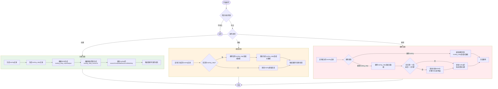
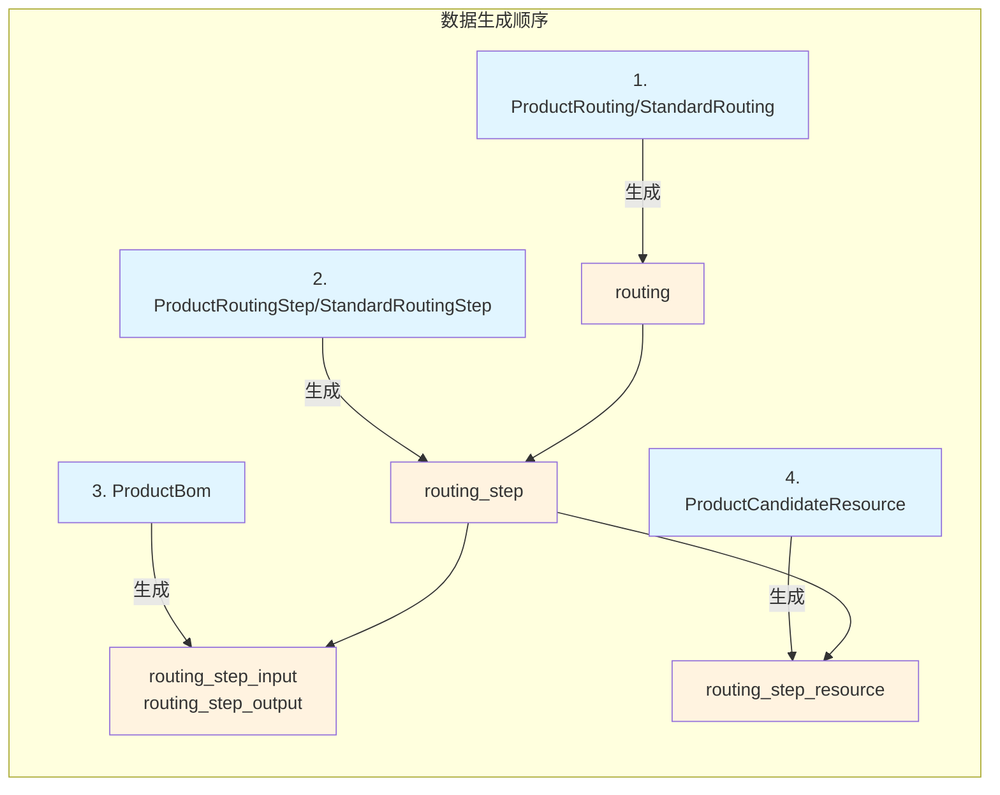
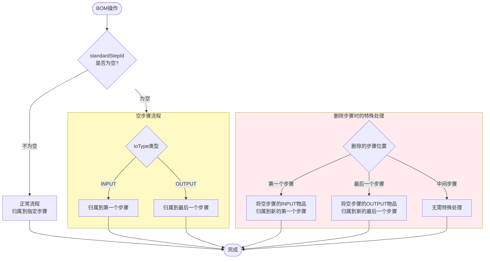
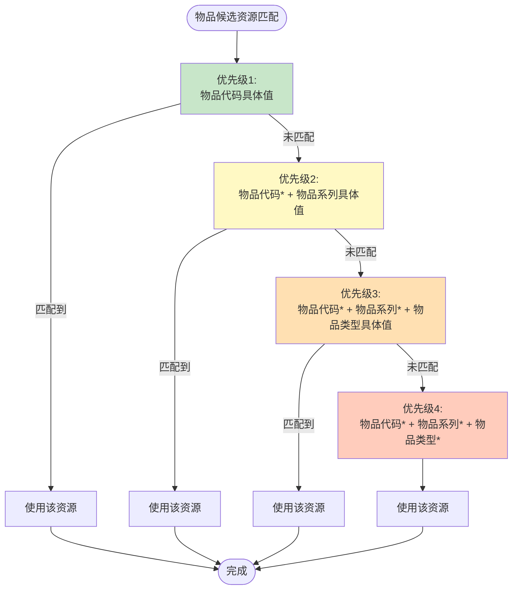
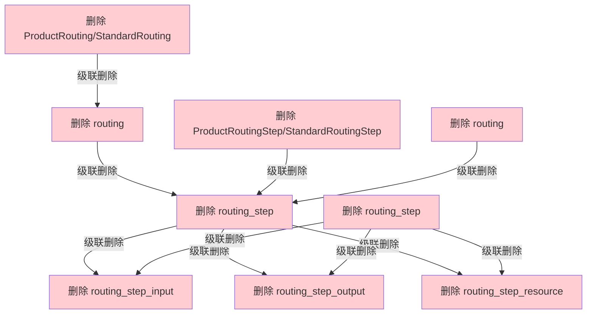

# 工艺路径数据流转流程图

## 完整数据流转图

```mermaid
flowchart TB
    subgraph 全局参数控制
        GP1[routing_data_type<br/>控制是否生成routing]
        GP2[bom_data_type<br/>控制BOM类型]
        GP3[candidate_resource_data_type<br/>控制候选资源类型]
    end

    subgraph 基础数据层[基础数据层 - 源数据]
        PR[物品工艺路径<br/>ProductRouting]
        PRS[物品工艺路径步骤<br/>ProductRoutingStep]
        SR[标准工艺路径<br/>StandardRouting]
        SRS[标准工艺路径步骤<br/>StandardRoutingStep]
        PCR[物品候选资源<br/>ProductCandidateResource]
        PB[物品BOM<br/>ProductBom]
    end

    subgraph 最终路径结果层[最终路径结果层 - 目标数据]
        R[routing<br/>工艺路径]
        RS[routing_step<br/>工艺路径步骤]
        RSI[routing_step_input<br/>工艺路径步骤输入]
        RSO[routing_step_output<br/>工艺路径步骤输出]
        RSR[routing_step_resource<br/>工艺路径步骤资源]
    end

    %% 全局参数控制
    GP1 --> PR
    GP1 --> SR
    GP2 --> PB
    GP3 --> PCR

    %% 第一层：生成routing
    PR -->|doCreateRoutings<br/>根据BOM版本生成| R
    PR -->|doUpdateRoutings<br/>更新基础信息| R
    PR -->|doDeleteRoutings<br/>级联删除| R
    
    SR -->|doCreateRoutings<br/>为每个库存点物品生成| R
    SR -->|doUpdateRoutings<br/>更新基础信息| R
    SR -->|doDeleteRoutings<br/>级联删除| R

    %% 第二层：生成routing_step
    PRS -->|doCreateRoutingSteps<br/>生成步骤| RS
    PRS -->|doUpdateRoutingSteps<br/>先删后建| RS
    PRS -->|doDeleteRoutingSteps<br/>删除步骤| RS
    
    SRS -->|doCreateRoutingSteps<br/>生成步骤| RS
    SRS -->|doUpdateRoutingSteps<br/>先删后建| RS
    SRS -->|doDeleteRoutingSteps<br/>删除步骤| RS

    %% 第三层：生成input/output
    PB -->|doCreateRoutingStepBom<br/>根据BOM生成| RSI
    PB -->|doCreateRoutingStepBom<br/>根据BOM生成| RSO
    PB -->|doUpdateRoutingStepBom<br/>先删后建| RSI
    PB -->|doUpdateRoutingStepBom<br/>先删后建| RSO
    PB -->|doDeleteRoutingStepBom<br/>删除| RSI
    PB -->|doDeleteRoutingStepBom<br/>删除| RSO

    %% 第四层：生成resource
    PCR -->|doCreateOrDeleteRoutingStepResource<br/>生成资源| RSR
    PCR -->|doUpdateRoutingStepResource<br/>更新资源| RSR
    PCR -->|doCreateOrDeleteRoutingStepResource<br/>删除资源| RSR

    %% routing到routing_step的关系
    R -->|包含| RS
    RS -->|包含| RSI
    RS -->|包含| RSO
    RS -->|包含| RSR

    %% 级联删除关系
    R -.->|级联删除| RS
    RS -.->|级联删除| RSI
    RS -.->|级联删除| RSO
    RS -.->|级联删除| RSR

    %% 样式
    classDef sourceData fill:#e1f5ff,stroke:#01579b,stroke-width:2px
    classDef targetData fill:#fff3e0,stroke:#e65100,stroke-width:2px
    classDef globalParam fill:#f3e5f5,stroke:#4a148c,stroke-width:2px

    class PR,PRS,SR,SRS,PCR,PB sourceData
    class R,RS,RSI,RSO,RSR targetData
    class GP1,GP2,GP3 globalParam
```

## 详细操作流程图

```mermaid
flowchart TD
    Start([开始操作]) --> CheckParam{检查全局参数}
    CheckParam -->|不符合| End1([结束])
    CheckParam -->|符合| OperationType{操作类型}
    
    OperationType -->|创建| CreateFlow[创建流程]
    OperationType -->|更新| UpdateFlow[更新流程]
    OperationType -->|删除| DeleteFlow[删除流程]
    
    subgraph CreateFlow[创建流程]
        C1[生成routing记录] --> C2[生成routing_step记录]
        C2 --> C3[根据BOM生成<br/>routing_step_input/output]
        C3 --> C4[根据候选资源生成<br/>routing_step_resource]
        C4 --> C5[更新routing的<br/>sourceCandidateResourceMainKey]
        C5 --> C6[触发路径有效性校验]
    end
    
    subgraph UpdateFlow[更新流程]
        U1[查询已生成的routing记录] --> U2{是否有routing_step?}
        U2 -->|有| U3[删除旧的routing_step及相关数据]
        U3 --> U4[重新生成routing_step及相关数据]
        U2 -->|无| U5[更新routing基础信息]
        U4 --> U6[触发路径有效性校验]
        U5 --> U6
    end
    
    subgraph DeleteFlow[删除流程]
        D1[查询相关的routing记录] --> D2{删除类型}
        D2 -->|删除routing| D3[级联删除所有<br/>routing_step及相关数据]
        D2 -->|删除routing_step| D4[删除routing_step及相关数据]
        D4 --> D5{是否第一个或<br/>最后一个步骤?}
        D5 -->|是| D6[重新分配BOM中<br/>步骤ID为空的物品]
        D5 -->|否| D7[更新routing的<br/>候选资源主键]
        D6 --> D7
        D3 --> D8[完成删除]
        D7 --> D8
    end
    
    CreateFlow --> End2([完成])
    UpdateFlow --> End2
    DeleteFlow --> End2
    
    style CreateFlow fill:#e8f5e9
    style UpdateFlow fill:#fff3e0
    style DeleteFlow fill:#ffebee
```

## 数据依赖关系图

```mermaid
graph LR
    subgraph 数据生成顺序
        A1[1. ProductRouting/StandardRouting] -->|生成| B1[routing]
        A2[2. ProductRoutingStep/StandardRoutingStep] -->|生成| B2[routing_step]
        A3[3. ProductBom] -->|生成| B3[routing_step_input<br/>routing_step_output]
        A4[4. ProductCandidateResource] -->|生成| B4[routing_step_resource]
    end
    
    B1 --> B2
    B2 --> B3
    B2 --> B4
    
    style A1 fill:#e1f5ff
    style A2 fill:#e1f5ff
    style A3 fill:#e1f5ff
    style A4 fill:#e1f5ff
    style B1 fill:#fff3e0
    style B2 fill:#fff3e0
    style B3 fill:#fff3e0
    style B4 fill:#fff3e0
```

## BOM特殊处理流程图

```mermaid
flowchart TD
    Start([BOM操作]) --> CheckStepId{standardStepId<br/>是否为空?}
    
    CheckStepId -->|不为空| NormalFlow[正常流程<br/>归属到指定步骤]
    CheckStepId -->|为空| EmptyStepFlow[空步骤流程]
    
    subgraph EmptyStepFlow[空步骤流程]
        E1{ioType类型} -->|INPUT| E2[归属到第一个步骤]
        E1 -->|OUTPUT| E3[归属到最后一个步骤]
    end
    
    subgraph DeleteStepFlow[删除步骤时的特殊处理]
        D1{删除的步骤位置} -->|第一个步骤| D2[将空步骤的INPUT物品<br/>归属到新的第一个步骤]
        D1 -->|最后一个步骤| D3[将空步骤的OUTPUT物品<br/>归属到新的最后一个步骤]
        D1 -->|中间步骤| D4[无需特殊处理]
    end
    
    NormalFlow --> End([完成])
    E2 --> End
    E3 --> End
    D2 --> End
    D3 --> End
    D4 --> End
    
    style EmptyStepFlow fill:#fff9c4
    style DeleteStepFlow fill:#ffebee
```

## 候选资源匹配优先级图

```mermaid
flowchart TD
    Start([物品候选资源匹配]) --> Level1[优先级1:<br/>物品代码具体值]
    Level1 -->|匹配到| Success1[使用该资源]
    Level1 -->|未匹配| Level2[优先级2:<br/>物品代码* + 物品系列具体值]
    Level2 -->|匹配到| Success2[使用该资源]
    Level2 -->|未匹配| Level3[优先级3:<br/>物品代码* + 物品系列* + 物品类型具体值]
    Level3 -->|匹配到| Success3[使用该资源]
    Level3 -->|未匹配| Level4[优先级4:<br/>物品代码* + 物品系列* + 物品类型*]
    Level4 --> Success4[使用该资源]
    
    Success1 --> End([完成])
    Success2 --> End
    Success3 --> End
    Success4 --> End
    
    style Level1 fill:#c8e6c9
    style Level2 fill:#fff9c4
    style Level3 fill:#ffe0b2
    style Level4 fill:#ffccbc
```

## 级联删除关系图

```mermaid
graph TD
    A[删除 ProductRouting/StandardRouting] -->|级联删除| B[删除 routing]
    B -->|级联删除| C[删除 routing_step]
    C -->|级联删除| D[删除 routing_step_input]
    C -->|级联删除| E[删除 routing_step_output]
    C -->|级联删除| F[删除 routing_step_resource]
    
    G[删除 ProductRoutingStep/StandardRoutingStep] -->|级联删除| C
    
    H[删除 routing] -->|级联删除| C
    
    I[删除 routing_step] -->|级联删除| D
    I -->|级联删除| E
    I -->|级联删除| F
    
    style A fill:#ffcdd2
    style G fill:#ffcdd2
    style B fill:#ffcdd2
    style C fill:#ffcdd2
    style D fill:#ffcdd2
    style E fill:#ffcdd2
    style F fill:#ffcdd2
    style H fill:#ffcdd2
    style I fill:#ffcdd2
```

